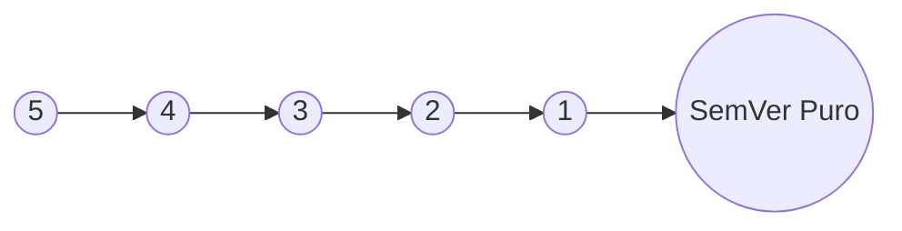
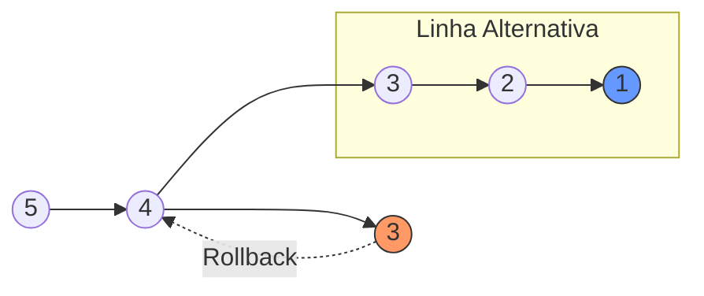
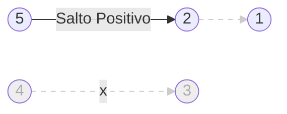
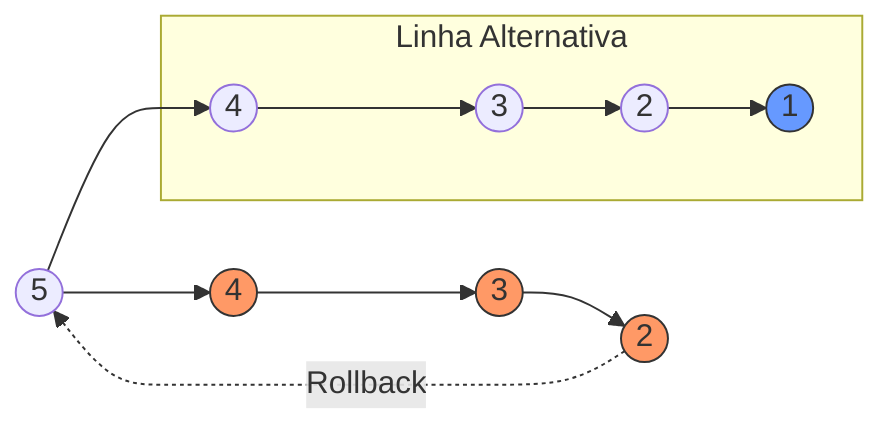
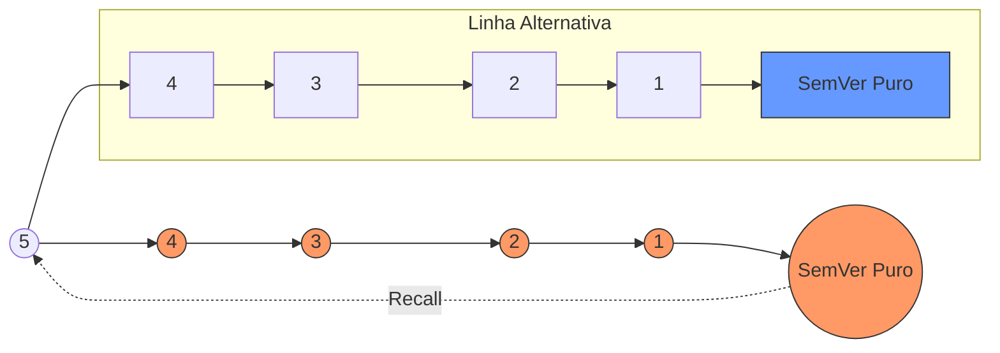
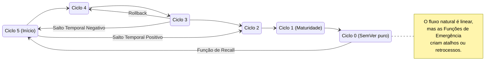
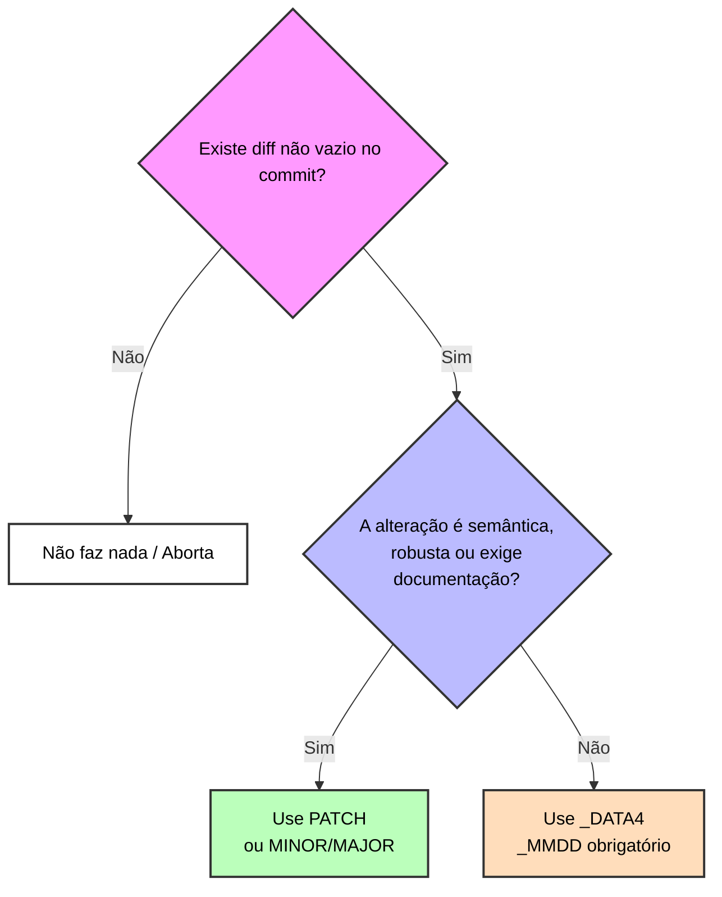

# **VRLC – VagalumeRaceLightCycle 3.1.1.0.0_20260310**

**Sumário:**

1. **Descrição**
2. **Explicação Curta sobre o Modelo VRLC**
   1. **Instalação do Validador**
   2. **Definições (Anatomia da Versão)**
   3. **Uso Prático**
3. **Detalhes Teóricos do Modelo (Especificação)**
   1. **O que é** **`CICLO`** **(C)?**
      1. **Funcionamento completo do campo** **`CICLO`**
      2. **Exemplos de uso do Campo** **`CICLO`**
   2. **O que é** **`HERDEIRO`** **(H)?**
      1. **Funcionamento completo do Campo** **`HERDEIRO`**
      2. **Exemplos de uso do Campo** **`HERDEIRO`**
   3. **O que é** **`_DATA`** **(\_D)?**
      1. **Funcionamento completo do Campo** **`_DATA`**
      2. **Exemplos de uso do Campo** **`_DATA`**
   4. **Núcleo SemVer**
      1. `MAJOR`
      2. `MINOR`
      3. `PATCH`
4. **Uso geral do VRLC**
5. **Q\&A**

---

---

# VRLC 1.0.0-amarelo

# 1. **Descrição**

VRLC – VagalumeRaceLightCycle é um modelo de versionamento semântico construído sobre o núcleo do SemVer, mas redesenhado para **clareza humana**. Ele resolve a subjetividade de termos como "Alpha" ou "Beta", substituindo-os por um sistema de progressão visual e objetiva.

## **Os 5 Ciclos de Corrida**

Inspirado na grelha de partida da Fórmula 1, o VRLC divide o desenvolvimento em 5 estágios obrigatórios (do 5 ao 1):

| Ciclo | Nome        | Descrição                                                                                          |
| ----- | ----------- | -------------------------------------------------------------------------------------------------- |
| 5     | Oficina     | 🔧 (of) Fase experimental. O projeto está no cavalete, sujeito a mudanças drásticas.                |
| 4     | Vermelho    | 🔴 (vm) Início dos testes. O motor ligou, mas o carro ainda é frágil.                               |
| 3     | Amarelo     | 🟡 (am) Estabilização. Ajustes finos e interface funcional.                                         |
| 2     | Verde       | 🟢 (vd) Pronto para testes de pista. O sistema é estável e confiável.                               |
| 1     | Largada     | 🏁 (la) Versão única para lançamento do projeto.                                                    |
| 0     | Pós-Largada | Após a largada, o VRLC é descartado, e o projeto segue o formato`MAJOR.MINOR.PATCH` (SemVer puro). |

O modelo se apresenta em quatro formatos de visualização:

| Formato        | Exemplo                   | Observação                                       |
| -------------- | ------------------------- | ------------------------------------------------ |
| **Estendida:** | `VRLC 2.1.2.0.0_20260305` | # Para sistemas e logs completos                 |
| **Resumida:**  | `VRLC 2.0.0-verde`        | # Para comunicação rápida ou visual e relatórios |
| **Compacta:**  | `VRLC 2-verde`            | # Para visualização rápida em interfaces         |
| **Abreviada:** | `VRLC 2-ver`              | # Para visualização rápida em interfaces         |

## **Diferenciais Técnicos**

O VRLC introduz dois conceitos fundamentais:

1. **Campo Herdeiro:** Permite manter o histórico de MAJORs antigos, evitando o reinício artificial da contagem ao adotar o modelo no meio da vida de um projeto e permitindo o projeto voltar no tempo.
2. **Versão Gêmea (`_DATA`):** Um mecanismo para registrar alterações cosméticas ou invisíveis (documentação, formatação) que não alteram a lógica funcional nem a função do software, mas agora podem ser rastreadas.

---

---

# 2. **Explicação Curta sobre o Modelo VRLC**

O VRLC (VagalumeRaceLightCycle) é uma especificação de versionamento semântico de seis campos (`CICLO.HERDEIRO.MAJOR.MINOR.PATCH_DATA`) baseado em SemVer que organiza a evolução do software em 5 ciclos inspirados em etapas de corrida de fórmula 1, preservando o histórico com o uso do campo **Herdeiro**.

## **1. Instalação do Validador**

Para garantir que suas versões sigam as regras da pista, use o validador do VRLC:

[MANUAL DO VALIDADOR](manual_validador.md)

Instalação:

`pip install git+https://github.com/w-marck/vrlc.git`

Na importação do projeto, escreva:

`from vrlc import VRLCVersion`

Depois, escreva:

```python
v = VRLCVersion("5.0.1.0.1_YYYYMMDD")

version = v
```

## **2. Definições (Anatomia da Versão)**

Formação: `CICLO.HERDEIRO.MAJOR.MINOR.PATCH_DATA`

- **CICLO (5 a 1):** O estágio de maturidade (`5=Oficina(of), 4=Vermelho(vm), 3=Amarelo(am), 2=Verde(vd), 1=Largada`).
- **HERDEIRO:** O último `MAJOR` do ciclo ou modelo anterior. Nunca muda durante um ciclo.
- **MAJOR:** Reinicia em **1** a cada novo ciclo. Indica mudanças estruturais.
- **MINOR:** Adições de funcionalidades compatíveis.
- **PATCH:** Correções de bugs.
- **\_DATA:** Sufixo obrigatório em transições de ciclo ou para criar **Versões Gêmeas** (ajustes que não alteram a lógica) pode ter a forma \_YYYYMMDD ou \_MMDD.

### Representações da versão VRLC:

O mesmo número de versão pode (e deve) ser apresentado de quatro formas diferentes, dependendo do contexto:

> **Estendida** — formato completo e técnico
> Exemplo: `5.0.1.0.0_20260305` ou `C.H.SemVer_DATA`
> Uso: logs, commits, tags de repositório, arquivos de versão, comunicação entre ferramentas e validação interna.
> É o formato canônico durante os ciclos 5–1.

> **Resumida** — formato humano e visual (recomendado para relatórios, READMEs, changelogs e comunicação com usuários)
> Exemplo: `1.0.0-oficina` ou `SemVer-nome_do_ciclo`
> Uso: badges, cabeçalhos de documentação, mensagens de release, interfaces de usuário.
> Mostra o progresso na pista de forma imediata e colorida.

> **Compacta** — versão ultra-curta (para espaços limitados)
> Exemplo: `1-oficina` ou `MAJOR.MINOR>0.PATCH>0-nome_do_ciclo`.
> Uso: ícones, tooltips, status em dashboards, nomes de branches curtos, notificações.
> Prioriza brevidade sem perder o contexto do ciclo.
> obs: `MINOR>0` significa que o `MINOR` deve ser colocado apenas se for maior que 0.
> obs2: `PATCH>0` significa que o `PATCH` deve ser colocado apenas se for maior que 0.
> obs3: `PATCH` é opcional nesta representação, mas o `MINOR` sempre deve ser colocado se for maior que 0.

> **Abreviada** - versão abreviada da versão compacta (para espaços muito limitados)
> Exemplo: `1-of` ou `MAJOR-nome_do_ciclo`
> referência de abreviaturas:`oficina=of vermelho=vm amarelo=am verde=vd largada=la`
> Uso: ícones, tooltips, status em dashboards, nomes de branches curtos, notificações.
> Prioriza menor número de caracteres sem perder o contexto do ciclo.

**Nota importante:**

- Durante os ciclos 5–1, as três formas **incluem o nome do ciclo** (oficina, vermelho, amarelo, verde, largada).
- Após a Largada (pós-ciclo 1), o nome do ciclo desaparece e as representações voltam ao SemVer puro:
  - Estendida: `1.17.50_0228`
  - Resumida: `1.17.50`
  - Compacta: `1.17`
  - Abreviada: `1`

---

### **3. Uso Prático**

O modelo segue a estrutura rígida: `CICLO.HERDEIRO.MAJOR.MINOR.PATCH_DATA`

> \*\*Nota sobre o sufixo `_DATA**`:
> 
> - **`_YYYYMMDD`** **(8 dígitos):** Obrigatório em transições de ciclo, primeira versão do projeto ou primeira versão do ano civil.
> - **`_MMDD`** **(4 dígitos):** Utilizado para "Versões Gêmeas" (quando você precisa lançar um hotfix ou ajuste no mesmo dia e quer manter o rastro temporal sem necessariamente dar um bump semântico pesado).

---

### **1. Usando o modelo (Manual de Atualização)**

Para atualizar o versionamento manualmente, siga a hierarquia de importância do VRLC. O segredo é entender que o "núcleo" SemVer (`MAJOR.MINOR.PATCH`) gira dentro da "moldura" de estado do projeto (`CICLO`).

#### **A. O Ponto de Partida (Ciclo 5 - Oficina)**

Todo projeto novo ou que inicia a jornada VRLC deve ser inicializado no Ciclo 5-Oficina.

- **Ação:** Criar a primeira tag.
- **Versão:** `5.0.1.0.0_20260307`
- *5* (Ciclo inicial), *0* (projeto inicial), *1.0.0* (Início do núcleo SemVer), *\_Data* (Carimbo de nascimento).

> Obs: Projetos iniciados antes do VRLC podem colocar seu MAJOR no campo HERDEIRO Ex: projeto atualmente em v15.x.x entao VRLCVersion(`5.15.1.0.0_YYYYMMDD`) (Ciclo 5, Herdeiro 15, MAJOR 1, MINOR 0, PATCH 0 \_YYYYMMDD)
> O campo HERDEIRO mantem o mesmo valor durante toda vida do ciclo atual.

#### **B. Evolução de Rotina (SemVer Core)**

Enquanto estiver no mesmo ciclo (ex: Oficina), você manipula apenas o núcleo central.

1. **Ajuste Fino (Patch):** `5.0.1.0.1` — Pequenas correções de bugs.
2. **Nova Funcionalidade (Minor):** `5.0.1.1.0` — Adição de recursos sem quebra de compatibilidade.
3. **Mudança Estrutural (Major):** `5.0.2.0.0` — Quando você destrói algo para construir melhor (ainda dentro da fase experimental).

#### **C. O Uso de Versões Gêmeas**

Se você lançou a `5.0.1.0.1` pela manhã e descobriu um erro de digitação bizarro cinco minutos depois:

- **Ação:** Não precisa necessariamente pular para `.0.2` se não quiser sujar o log semântico.
- **Versão:** `5.0.1.0.1_0307` — Isso indica que é uma revisão da mesma versão lógica no mesmo dia.

#### **D. Transição de Ciclo (A Mudança de Fase)**

Ao decidir que o projeto saiu do ciclo 5-Oficina (desenvolvimento inicial) e entrou no ciclo 4-Vermelho (Testes iniciais), as regras mudam:

1. **Ciclo:** Decrementa (5 → 4).

2. **Herdeiro:** Herda o último MAJOR e salva o estado da última versão do ciclo anterior.

3. **Núcleo SemVer:** **Reseta** para `1.0.0`.

4. **Data:** Obrigatória em formato
   \_YYYYMMDD.
- **Exemplo:** De `5.0.115.2.10` para `4.115.1.0.0_20260415`.

Obs: **ação manual:** FAÇA BACKUP do projeto inteiro como `5.0.115.2.10.0_20260415` e depois faça uma cópia exata do projeto com a versão `4.115.1.0.0_20260415`

#### **E. Ação de Emergência retorno a um ponto salvo**

A qualquer momento você pode realizar uma ação de emergência e voltar para qualquer ciclo no estado em que estava quando foi abandonado.
O HERDEIRO permite esses retornos.

Para retornar ao ciclo anterior manualmente em RollBack siga os passos a seguir:

1. FAÇA BACKUP do projeto inteiro com a versão original ex: `4.115.27.5.3_20260415`
2. Faça uma cópia exata do projeto completo para o qual deseja retornar ex: `5.0.115.2.10`
3. Atualize a nova cópia para `5.0.116.0.0_20260415`

Faça o mesmo processo para voltar para ciclos distantes, ex: ciclo 2-Verde para o 5-Oficina em salto temporal negativo.
(Expilcado na seção ## 2. **O que é** **`HERDEIRO`** **(H)?** - ### **1. Regra de Atualização em Transição de Ciclo** - **C. Salto Temporal Negativo (Retrocesso Brusco)**).

#### **F. A Chegada (Ciclo 1 e Pós-Largada)**

A `1.H.1.0.0_YYYYMMDD` é a última versão antes da estabilidade total. Após a "Largada", o prefixo de Ciclo e Herdeiro desaparecem, e o projeto assume o SemVer puro. parabéns! você lançou seu projeto.

- **Última VRLC, versão de lançamento:** `1.H.1.0.0_20261231`
- **Primeira Estável pśo lançamento:** `1.0.1`

Você pode usar a versão em 4 formatos de exibição:

estendida: `5.0.1.0.0_20261231`
resumida: `5.0.0-oficina`
compacta: `5-oficina`
abreviada: `5-of`

Mas no código principal do projeto ponha sempre a versão estendida.

**Como string:** Sempre use o formato completo com 5 números enquanto estiver nos ciclos 5 a 2. No Ciclo 1, após a primeira versão, você pode migrar para o SemVer puro.

### **2. Resumo de DO's e DONT'S**

| **✅ DO (Faça)**                                                          | **❌ DONT'T (Não faça)**                                                           |
| ------------------------------------------------------------------------ | --------------------------------------------------------------------------------- |
| Use`_DATA` de8 dígitos em toda mudança de Ciclo.                         | Não use`0` no MAJOR (VRLC começa em 1).                                           |
| Mantenha o Herdeiro fixo até o fim do ciclo.                             | Não use números diferentes de 5,4,3,2,1 no campo CICLO.                           |
| Use Versões Gêmeas para fix de digitação.                                | Não mantenha o SemVer do ciclo antigo no novo.                                    |
| Use Herdeiro para voltar um ciclo e atualizar CICLO=-1+MAJOR=Herdeiro+1. | Não use DATA de 4 dígitos em primeira versão de ciclo, ela é para versões gêmeas. |

*(Para exemplos detalhados de fluxos de transição, veja a xª parte deste documento).*

---

---

# 3. **Detalhes Teóricos do Modelo (Especificação Técnica)**

Esta seção estabelece as regras formais completas que definem o **VRLC (VagalumeRaceLightCycle)**. O cumprimento destas normas garante a integridade do histórico de desenvolvimento e a clareza na comunicação da maturidade do software.

O VRLC é uma especificação de versionamento semântico de cinco níveis 5-1 e 7 campos (`CICLO.HERDEIRO.MAJOR.MINOR.PATCH`). Embora possa ser validado por ferramentas automatizadas, a autoridade do modelo reside nas regras descritas neste manual.

As palavras-chave **“DEVE”**, **“NÃO DEVE”**, **“OBRIGATÓRIO”**, **“DEVERÁ”**, **“NÃO DEVERÁ”**, **“PODEM”**, **“NÃO PODEM”**, **“RECOMENDADO”**, **“PODE”** e **“OPCIONAL”** neste documento devem ser interpretadas conforme descrito na [RFC 2119](http://tools.ietf.org/html/rfc2119).

| Código  | palavra-chave     | código  | palavra-chave           |
| ------- | ----------------- | ------- | ----------------------- |
| C       | CICLO             | H       | HERDEIRO                |
| M       | MAJOR             | m       | MINOR                   |
| p       | PATCH             | \_D     | DATA                    |
| SemVer  | MAJOR.MINOR.PATCH | SemVer0 | MAJOR=1.MINOR=0.PATCH=0 |
| \_D8    | \_YYYYMMDD        | \_D4    | \_MMDD                  |
| \_DATA8 | \_YYYYMMDD        | \_DATA4 | \_MMDD                  |
| N       | Nome do Ciclo     | n       | Nome do Ciclo abreviado |

| Nome do padrão    | Formato                        |
| ----------------- | ------------------------------ |
| Padrão extenso    | `C.H.SemVer_DATA`              |
| Padrão resumido:  | `SemVer-N`                     |
| Padrão compacto:  | `SemVer-N` ou `M.m-N` ou `M-N` |
| Padrão abreviado: | `M-n`                          |

Referência de números de ciclo:`5=oficina 4=vermelho 3=amarelo 2=verde 1=largada`

Referência de abreviaturas:`oficina=of vermelho=vm amarelo=am verde=vd largada=la`

---

## 1. **O que é** **`CICLO`** **(C)?**

O campo **CICLO** DEVE ser o primeiro dígito da versão no formato estendido (`CICLO.H.SemVer`). Ele representa o estado de maturidade e confiabilidade do projeto. A transição entre ciclos indica uma mudança qualitativa na prontidão do software para o uso.

### **🔧 Ciclo 5 — Oficina**

O projeto DEVE ser considerado em fase puramente experimental.

- **Estado:** O código PODE estar incompleto e funcionalidades básicas NÃO PODEM ser garantidas.
- **Interface:** A UI/UX PODE ser inexistente ou meramente funcional (mínima).
- **Distribuição:** O software NÃO DEVE ser distribuído para uso externo e NÃO DEVE ser usado por usuário comum, sendo restrito a desenvolvedores e testes de laboratório.
- *Exemplos:* Testes de algoritmos, esboços de arquitetura, provas de conceito (PoC).

### **🔴 Ciclo 4 — Vermelho**

O projeto DEVE representar a primeira versão minimamente usável.

- **Estado:** A funcionalidade principal DEVE estar presente, porém PODE ser instável ou "quebradiça".
- **Interface:** O design DEVE começar a tomar forma, mas ajustes drásticos ainda PODEM ocorrer.
- **Confiabilidade:** Falhas críticas são esperadas. O uso PODE ser feito por terceiros, desde que cientes da fragilidade do sistema.

### **🟡 Ciclo 3 — Amarelo**

O projeto DEVE atingir estabilidade de interface e lógica central.

- **Estado:** A funcionalidade principal DEVE operar corretamente na maioria dos cenários. Funções secundárias PODEM ainda estar em fase de validação.
- **Interface:** A interface DEVE ser estável. Mudanças estéticas PODEM ocorrer, mas a estrutura principal de interação DEVE ser preservada.
- **Público:** RECOMENDADO para testes com grupos selecionados de usuários finais.

### **🟢 Ciclo 2 — Verde**

O projeto DEVE ser considerado estável, funcional e confiável.

- **Estado:** Todas as partes visíveis DEVEM estar integradas. Bugs remanescentes NÃO DEVEM ser críticos.
- **Interface:** DEVE estar polida. Adições cosméticas ou de ferramentas auxiliares ainda PODEM ocorrer.
- **Distribuição:** Pronto para uso público geral, embora com aviso de estágio pré-lançamento.

### **🏁 Ciclo 1 — Largada**

O projeto ATINGE o estado de versão oficial, madura e robusta.

- **Estado:** O núcleo do programa DEVE estar finalizado. Bugs DEVEM ser raros e tratados como exceções pontuais.
- **Transição:** Este ciclo possui uma característica ÚNICA: ele DEVE ser representado apenas uma vez no formato `1.H.SemVer0_DATA`.
- **Pós-Largada:** Após a primeira versão estável, o dígito do CICLO e o dígito HERDADO DEVEM ser descartados, e o projeto DEVERÁ seguir o formato `SemVer_DATA` sendo `_DATA4` para versões gêmeas e `_DATA8` para 1ª versão nova do ano.

---

### 2. **Funcionamento completo do campo CICLO**

O campo **CICLO** é o primeiro número da versão no formato estendida e **DEVE** estar presente enquanto o projeto estiver nos estágios de pré-lançamento. Ele funciona como o “semáforo” oficial do VRLC: indica exatamente em que ponto da corrida o software está.

### Regras obrigatórias do campo CICLO

1. **Valores permitidos**
   O CICLO **DEVE** ser um número inteiro entre **1** e **5**.
   Qualquer outro valor (0, 6 ou superior, ou não inteiro) é **rejeitado** pelo modelo.

2. **Progressão obrigatória decrescente** `# ATENÇÃO: verificar as exceções a regra`
   A sequência natural é:
   **5 → 4 → 3 → 2 → 1**  ou **Oficina - Vermelho - Amarelo - Verde - Largada**
   Cada passo representa um salto qualitativo de maturidade.

3. **Imutabilidade dentro do mesmo ciclo**Enquanto estiver no mesmo ciclo, o número do CICLO **NÃO PODE** mudar.Bump de MINOR ou PATCH mantém o mesmo CICLO.Exemplo:
   
   - `C.H.3.4.2`
   - `C.H.3.5.0` (mesmo CICLO)
   - `C-1.3.SemVer0_DATA8` (Novo CICLO)

4. **Transição para um novo ciclo**Toda mudança de ciclo **DEVE** ser registrada como:`C.H.SemVer0_DATA8`onde:
   
   - `C` = novo ciclo
   - `H` = HERDEIRO (MAJOR do ciclo anterior, explicado na seção seguinte)
   - `1.0.0` = reset obrigatório do núcleo SemVer
   - `_DATA8` = data completa (YYYYMMDD) obrigatória na primeira versão de qualquer ciclo.
     -

5. **Maturidade do ciclo**
   A mudança de ciclo **DEVE** ocorrer quando a maturidade do ciclo atual estiver plenamente atingida. Ou seja, TODOS os requisitos do ciclo atual estiverem plenamente stisfeitas e PELOMENOS um requisito do ciclo seguinte satisfeito. Isso significa que, por exemplo, um projeto **DEVE** atingir TODOS os requisitos do ciclo 5 e pelomenos um requisito do ciclo 4 antes de subir para o ciclo 4.

6. **Ciclo 1 — Largada (versão única)**
   Este ciclo possui uma regra especial:
   
   - Existe **apenas uma única versão** com CICLO = 1
   - Ela **sempre** deve ser `1.H.SemVer00_DATA8`
   - Após essa versão, o campo CICLO desaparece para sempre.
   - Todas as versões seguintes usam o formato SemVer puro:
     `SemVer_DATA`

7. **Saltos de ciclo são permitidos**
   O modelo permite saltar ciclos (ex: 5 → 3, 4 → 1, etc.) quando a maturidade do ciclo anterior ao de destino estiver plenamente atingida. ver item 5.
   A notação continua sendo a mesma:
   `novo_C.H.SemVer0_DATA8`
   Isso só é possível por causa do campo HERDEIRO, expclicado na seção seguinte.
   **Recomendação:** Esta é um dos mecanismos de Emergência, então só salte se houver motivo técnico forte — a progressão sequencial é o caminho mais claro para usuários e equipe.

8. **Fim do campo CICLO**
   Depois da versão de Largada, o projeto migra permanentemente para SemVer clássico.
   Exemplo de sequência correta no final da pista:
   
   ```
   1.H.1.0.0_20260305    ← única versão com CICLO = 1
   1.0.1                 ← SemVer puro
   1.1.0
   2.0.0
   2.15.20               ← versão anterior imediata da gêmea
   2.15.20_DATA4         ← Versão gêmea
   ```

### Resumo visual das formas de versão (durante os ciclos)

- Versão normal dentro do ciclo: `C.H.SemVer` ou `C.H.SemVer_DATA4`.
- Primeira versão de qualquer ciclo é versão de transição: `C.H.SemVer0_DATA8`
- Primeira versão do ano: `C.H.SemVer_DATA8`
- Após Largada: `SemVer` ou `SemVer_DATA4`
- Primeira versão do ano SemVer puro: `C.H.SemVer_DATA8`

Essa é a regra de ouro do VRLC: o CICLO guia a corrida, mas só aparece enquanto ainda estamos nos boxes. Depois da Largada, ele some e o SemVer puro assume o volante.

---

## 2. **O que é** **`HERDEIRO`** **(H)?**

O **HERDEIRO (H)** é o segundo dígito identificador na estrutura de versão estendida do modelo VRLC (`C.H.SemVer_DATA`). Ele é definido como a **memória histórica** do projeto, atuando como o elo de continuidade técnica entre as transições de ciclo.

### **Definição e Natureza**

Enquanto o Núcleo **SemVer** DEVE ser reiniciado para `SemVer0` a cada mudança de ciclo para sinalizar um novo estágio de maturidade, o **HERDEIRO DEVE** preservar o valor do último **MAJOR** relevante da fase anterior. Ele funciona como um **ponto salvo recuperável (Save Point)**: uma marcação técnica que permite que o software transite entre estados de prontidão (ex: de oficina para vermelho) sem que o rastro de sua complexidade e evolução anterior seja descartado.

### **O Papel de "Âncora de Realidade"**

A função primordial do HERDEIRO (H) é garantir que o VRLC possa ser aplicado a qualquer momento da vida de um software. Ele impede o "zeramento artificial" do progresso; se um projeto já está em sua versão `15.0.0` e adere ao VRLC, o HERDEIRO (H) **DEVE** assumir o valor `15`, mantendo a referência histórica ativa dentro da nova estrutura de ciclos.

### **Capacidade de Recuperação e Funções de Emergência**

O HERDEIRO (H) é o componente que viabiliza as **Funções de Emergência** do modelo. Por marcar um estado estável anterior, ele permite que o projeto realize retrocessos (Rollbacks) ou reentradas no modelo (Recalls) com precisão. Ele serve como o "viajante do tempo" ou "ponto salvo" que indica ao sistema qual era o último ponto de consistência antes de uma falha em um ciclo superior, permitindo a restauração da linha do tempo de desenvolvimento sem perda de contexto.

### **Extinção do Campo**

O HERDEIRO (H) possui existência finita. Sua última aparição ocorre na versão única do **Ciclo 1 (Largada/la)**. Uma vez que o projeto atinge a estabilidade total e migra para o formato Pós-Largada (SemVer puro), o campo HERDEIRO (H) é descartado, pois a "memória de desenvolvimento" cumpriu seu papel e o software passa a ser regido apenas por sua evolução pública estável.

---

### 4. **Funcionamento Completo do Campo HERDEIRO (H)**

O funcionamento do campo HERDEIRO (H) é regido por uma lógica de persistência histórica ou "ponto salvo". Ele é o único componente da versão que foca exclusivamente em armazernar o estado do projeto no momento da transição entre ciclos.

#### **1. Regra de Atualização em Transição de Ciclo**

O valor do HERDEIRO (H) **DEVE** ser estático durante a permanência no ciclo. Sua atualização **DEVE** ocorrer unicamente no momento da promoção:

1. **Cálculo de Herança:** O HERDEIRO (H) **DEVE** assumir o valor do último MAJOR (M) do ciclo que se encerra.
2. **Reset de SemVer:** O Núcleo SemVer **DEVE** Reiniciar para `SemVer0`.

#### **2. Cenário de Adesão Tardia**

- **HERDEIRO (H):** **DEVE** receber o valor do último MAJOR estável pré-VRLC (Âncora de Realidade) em qualquer Ciclo.
- **Núcleo SemVer:** **DEVE** Reiniciar para `SemVer0`.

#### **3. Mecânica em Funções de Emergência**

As Funções de Emergência são mecanismos de manipulação da linha cronológica do projeto. Elas permitem que o desenvolvedor altere a trajetória de maturidade (Ciclos) fora do fluxo natural de avanço (5 → 4 → 3 → 2 → 1).



**Definições de símbolos** (complementar à tabela de códigos do início desta seção 3):

| Símbolo                                                 | Significado                                                        | Observação / Uso principal                          |
| ------------------------------------------------------- | ------------------------------------------------------------------ | --------------------------------------------------- |
| **C**                                                   | CICLO atual                                                        | Número 5 a 1                                        |
| **H**                                                   | HERDEIRO                                                           | Valor fixo dentro do ciclo                          |
| **M**                                                   | MAJOR atual                                                        | Reinicia em 1 a cada ciclo                          |
| **m**                                                   | MINOR                                                              | —                                                   |
| **p**                                                   | PATCH                                                              | —                                                   |
| **C<sub>Alvo</sub>**                                    | Ciclo de destino (para onde vai o salto/rollback)                  | —                                                   |
| **C<sub>Frente</sub>**                                  | Ciclo imediatamente superior ao alvo (o que está sendo abandonado) | Usado apenas em retrocessos                         |
| **H<sub>Ciclo\_Alvo</sub>** ou **H<sub>Alvo</sub>**     | HERDEIRO do ciclo de destino (valor histórico)                     | Recuperado em rollback/salto negativo com histórico |
| **H<sub>Ciclo\_Frente</sub>** ou **H<sub>Frente</sub>** | HERDEIRO do ciclo que está sendo abandonado                        | Usado na fórmula da Cicatriz de Continuidade        |
| **M<sub>Ciclo\_Frente</sub>**                           | MAJOR do ciclo que está sendo abandonado                           | Base para cálculo da cicatriz                       |
| **SemVer0**                                             | 1.0.0 (MAJOR=1, MINOR=0, PATCH=0)                                  | Reset obrigatório em transições e emergências       |

**A Teoria das Linhas de Tempo:**

- **Avanços (Positivos):** Quando o projeto evolui na linha natural ou salta para o futuro (ex: $5 \rightarrow 2$), a linha do tempo é preservada. O acesso ao histórico anterior permanece linear e contínuo.
- **Retrocessos (Negativos):** Ao realizar um movimento para um ciclo numericamente superior (ex: $3 \rightarrow 4$), ocorre uma **Ruptura de Continuidade**. Uma nova linha do tempo é gerada a partir do ponto de destino.

> \[!CAUTION]
> 
> **AVISO CRÍTICO DE RUPTURA TEMPORAL ⌛⚠️☢️**
> **NÃO** existe reversibilidade para a linha do tempo anterior após um retrocesso nesta versão do modelo. Uma vez acionada uma mudança de Ciclo para trás, a linha do tempo abandonada — incluindo os seus ficheiros, estrutura de diretórios e progresso específico — é considerada **Arquivada e Esquecida**.
> O projeto **DEVE** avançar estritamente a partir da nova ramificação criada no ciclo de destino. <span style="color: #FF0000;">**Operações de emergência**</span> que impliquem retrocesso **DEVEM ser executadas** **<span style="color: #FF0000;">*com cautela extrema***</span>, pois o rastro técnico da ramificação anterior torna-se inacessível para o versionamento ativo do modelo.

**Observações de Protocolo:**

1. **Registro de Timestamp:** Sempre que uma função de emergência é ativada, o campo \_DATA8 (\_YYYYMMDD) **DEVE** ser obrigatoriamente incluído no sufixo da versão para marcar o momento exato da anomalia de fluxo.
2. **Arquivamento Interrompido:** O modelo admite que o backup/histórico da linha do tempo cortada seja parcial. Ao retroceder (ex: $2 \rightarrow 4$), o rastro armazenado pode conter a totalidade dos ciclos anteriores ou apenas os fragmentos ativos no momento da ruptura.

**A. RollBack (Retrocesso Unitário)**
*Exemplo:* $(5 \rightarrow 4 \rightarrow 3\_{backup\_arquivado} \xrightarrow{\text{Rollback}} 4 \rightarrow 3\_{novo} \rightarrow 2 \rightarrow 1)$




Ocorre quando o projeto recua exatamente um ciclo.

- **HERDEIRO (H):** **DEVE** herdar o valor de **H** do ciclo que foi abandonado.
- **MAJOR (M):** **DEVE** seguir a fórmula $M = H\_{Ciclo\_Frente} + 1$.
- **Núcleo m.p:** **DEVE** ser zerado (.0.0).
- **\_D8:** **DEVE** registar a data do evento.

**B. Salto Temporal Positivo (Avanço Brusco)**
*Exemplo:* $(5 \rightarrow 2 \rightarrow 1)$



Ocorre quando o projeto pula estágios intermediários para acelerar o lançamento.

- **HERDEIRO (H):** **DEVE** ser zerado (H ≠ 0), sinalizando ausência de rastro linear imediato (Salto Positivo).
- **Núcleo SemVer:** **DEVE** reiniciar em 1.0.0 (SemVer0).
- **\_D8:** **DEVE** registar a data do evento.

**C. Salto Temporal Negativo (Retrocesso Brusco)**
*Exemplo:* $(2 \rightarrow 5)$



Ocorre quando o projeto recua múltiplos ciclos simultaneamente. Todo salto negativo **DEVE** portar a **Cicatriz de Continuidade** ($M = H\_{Ciclo\_Frente} + 1$).

**Definições Específicas:**

- **Ciclo Destino:** O ciclo alvo do retrocesso.  (ex: $C\_{Alvo}=5$)
- **Ciclo Frente:** O ciclo imediatamente posterior ao alvo (ex: $C\_{Frente}=4$).
- **Cenário 1 (Com Histórico):** Se o projeto já operou no ciclo destino anteriormente, o **H** **DEVE** recuperar o valor da última passagem estável por aquele ciclo. Se $H\_{Ciclo\_Frente} = 0$, caracteriza-se um Salto Duplo Sequencial (o ciclo posterior nunca existiu de facto).
- **Cenário 2 (Inédito):** Se o projeto nunca operou no ciclo destino (ex: pulou do 5 para o 2 e agora retrocede para o 4):
  - **Sem Adesão Tardia:** $H = 0$ e $SemVer = 1.0.0$.
  - **Com Adesão Tardia:** $H$ assume a âncora original e $SemVer = 1.0.0$.

**D. Recall (Retorno de Ciclo Zero)**
*Exemplo:* $(SemVer Puro \rightarrow 1 \dots 5)$



Ocorre quando um projeto já governado pelo SemVer Puro (Pós-VRLC) precisa retornar ao modelo por falha crítica ou reestruturação. O VRLC **DEVE** tratar este caso como um **Salto Temporal Negativo** a partir do estado de "Largada" concluída.

Resumo do uso das Funções de Emergência:



#### **4. Tabela de Estados**

| Situação                              | HERDEIRO (H)                             | MAJOR (M)                |
| ------------------------------------- | ---------------------------------------- | ------------------------ |
| **Início (Ciclo 5)**                  | `0` (ou Major anterior se adesão tardia) | **`SemVer0`**            |
| **Transição Normal**                  | `M` do ciclo anterior                    | **`SemVer0`**            |
| **Salto Positivo**                    | `0` (ou `H_pré-VRLC`)                    | **`SemVer0`**            |
| **Salto Negativo (Histórico)**        | `H` antigo do destino                    | **`H_Ciclo_Frente + 1`** |
| **Salto Negativo (Inédito)**          | `0`                                      | **`SemVer0`**            |
| **Salto Negativo (Inédito + Tardia)** | `H_pré-VRLC`                             | **`SemVer0`**            |
| **Pós-Largada**                       | *Extinto*                                | Segue SemVer Puro        |

---

### **5. Exemplos Práticos de Movimentação do HERDEIRO (H)**

Para compreender a mecânica do HERDEIRO (H), do MAJOR (M) e do Núcleo SemVer, acompanhe os fluxos de vida de diferentes projetos abaixo. As versões estão representadas em seu formato extenso `C.H.SemVer_DATA` para evidenciar os campos `CICLO.HERDEIRO.MAJOR`.

**1. Caminho Normal (Sem Adesão Tardia)**

O projeto nasce no VRLC no Ciclo 5 (Oficina/of) e evolui de forma linear.

```java
# Início no Ciclo 5 (Oficina/of) - Solo virgem, sem histórico

5.0.1.0.0_20260301    # H=0 (Início de projeto), SemVer0 (primeira versão).
5.0.2.m.p             # M avança com novas features
5.0.12.m.p            # Última versão estável do ciclo 5


# Promoção para o Ciclo 4 (Vermelho/vm)

4.12.1.0.0_20260510   # H assume o último M do ciclo anterior (12). SemVer0 (primeira versão).
4.12.4.m.p            # Evolução normal no ciclo 4 (Vermelho/vm)

# Se houve adesão tardia em ciclo 5, o HERDEIRO (H) assume o valor da âncora pré-VRLC (ex: `H = 15`) no ciclo 5 (oficina/of) onde entrou e o padrão VRLC continua normalmente
```

**2. Rollback de Emergência caminho normal**

O projeto passou pelo ciclo 3 (Amarelo/am) subiu para o ciclo 2 (Verde/vd) mas falhou e precisa voltar para o Ciclo 3 (Amarelo/am).

```java
# Evolução no Ciclo 3 (Amarelo/am)
3.38.13.m.p            # Última versão estável do ciclo 3 (Amarelo/am)

# Promoção para o Ciclo 2 (Verde/vd)

2.13.1.0.0_20260510   # H assume o último M do ciclo anterior (13). SemVer0 (primeira versão).
2.13.4.m.p            # Falha catastrófica aciona Função de emergência Rollback.

# Rollback para o Ciclo 3 (Amarelo/am)
# Regra: 
#    1. H assume o valor do passado (38) de quando esteve no mesmo ciclo.
#    2. Retrocesso de ciclo em M: M = H do ciclo de origem (ciclo 2 H=13) + 1
3.38.13.0.0_20260510   # H=38, M=13+1=14
3.38.14.m.p_20260510 # Evolução normal no ciclo 3 (Amarelo/am)

# Se houve adesão tardia em ciclo 5, o HERDEIRO (H) assume o valor da âncora pré-VRLC (ex: `H = 15`) no ciclo 5 (oficina/of) onde entrou e o padrão VRLC continua normalmente
# O SemVer ≠ SemVer0 com sulfixo _D8 caracteriza cicatriz de Continuidade.
```

**3. Rollback de Emergência após adesão tardia em ciclo avançado**

O projeto vem de um histórico SemVer puro (v15.x.x), entra no VRLC no Ciclo 2, e depois faz rollback para o Ciclo 3 onde nunca esteve.

```java
# Adesão Tardia no Ciclo 2 (Verde/vd)

2.15.1.0.0_20260301   # H=15 (Âncora pré-VRLC). SemVer0 (primeira versão).
2.15.4.m.p            # Falha grave no ciclo 2 aciona Função de emergência Rollback.

# Rollback para o Ciclo 3 (Amarelo/am)

3.15.1.0.0_20260301   # H=15 HERDEIRO recebe SemVer pre-VRLC (15). SemVer0 (primeira versão).
3.15.2.m.p            # Evolução normal no ciclo 3

# Obs: o retrocesso em adesão tardia sempre empurra o SemVer pré-VRLC para trás nos ciclos.
```

**4. Salto Temporal Positivo (Avanço Brusco)**

O projeto está no Ciclo 5, mas a equipe decide que ele já está maduro o suficiente para ir direto para o Ciclo 2 (Verde/vd), pulando o Vermelho/vm e o Amarelo/am.

```java
# Evolução no Ciclo 5 (Oficina/of)
5.0.1.0.0_20260301
5.0.470.m.p           # Projeto ganhou muita maturidade em um ciclo só.

# SALTO POSITIVO: 5 → 2
2.0.1.0.0_20260815    # H=0 (Confessa que pulou etapas e não tem herança do ciclo 3). SemVer0 (primeira versão).

# Se houve adesão tardia em qualquer ciclo, o HERDEIRO (H) assume o valor da âncora pré-VRLC (ex: `H = 15`) no ciclo onde entrou e o padrão VRLC continua normalmente
```

**5. Salto Temporal Negativo COM Histórico (A "Cicatriz" em Ação)**

O projeto seguiu o fluxo normal até o Ciclo 2 (Verde/vd), mas uma falha catastrófica obriga a equipe a recuar o projeto de volta para o Ciclo 4 (Vermelho/vm) (Salto de emergência).

```java
# Linha do tempo original
5.0.1.0.0_20260101 -> 5.0.3.m.p     # Termina o ciclo 5 com M=3
4.3.1.0.0_20260201 -> 4.3.7.m.p     # Termina o ciclo 4 com M=7
3.7.1.0.0_20260301 -> 3.7.12.m.p    # Termina o ciclo 3 com M=12
2.12.1.0.0_20260401 -> 2.12.5.m.p   # Falha crítica detectada no ciclo 2!

# SALTO NEGATIVO: 2 → 4 (Retrocesso para ciclo já visitado)
# Regra:
# 1. H recupera o valor antigo do destino (Ciclo 4 tinha H=3).
# 2. Cicatriz: O ciclo "frente" do destino na linha original é o 3. O H do ciclo 3 era 7. 
#    M assume (7 + 1) = 8 + _D8.
4.3.8.0.0_20260410    # O M=8 + _D8 prova que não é um ciclo 4 novo, mas uma continuação após falha.

# Se houve adesão tardia em ciclo 5, o HERDEIRO (H) assume o valor da âncora pré-VRLC (ex: `H = 15`) no ciclo 5 (oficina/of) onde entrou e o padrão VRLC continua normalmente
```

**6. Salto Temporal Negativo INÉDITO (Retrocesso para Solo Virgem)**

O projeto fez adesão tardia direto no Ciclo 3 (Amarelo/am) vindo da versão 22. Encontram um erro de arquitetura e precisam rebaixar o projeto para o Ciclo 5 (Oficina/of), onde ele nunca esteve.

```java
# Adesão Tardia no Ciclo 3 (Amarelo)
3.22.1.0.0_20260301   # Entrou com H=22 (Âncora). SemVer0 (primeira versão).
3.22.4.m.p            # Falha de arquitetura grave!

# SALTO NEGATIVO: 3 → 5 (Retrocesso para ciclo inédito adesão tardia)
# Regra: Como é solo virgem com adesão tardia prévia, H assume a âncora (22) e o núcleo SemVer reinicia.
5.22.1.0.0_20260315   # Aterrissagem forçada no ciclo 5 com a bagagem pré-VRLC preservada.

# Obs: o retrocesso em adesão tardia sempre empurra o SemVer pré-VRLC para trás nos ciclos.
```

**7. Rollback de Emergência após salto positivo**

O projeto saltou para o ciclo 2 (Verde/vd) mas falhou e precisa voltar para o Ciclo 3 (Amarelo/am), onde ele nunca esteve.

```java
# Promoção para o Ciclo 2 (Verde/vd)

2.17.1.0.0_20260510   # H assume o último M do ciclo anterior (17). SemVer0 (primeira versão).
2.17.4.m.p            # Falha catastrófica aciona Função de emergência Rollback.

# Rollback para o Ciclo 3 (Amarelo/am)
# Regra: Se o ciclo 3 nunca existiu o H assume 0. Mas se o ciclo 4 exstiu Herdeiro lembra M_C4 então H=M_C4. (HERDEIRO se lembra do passado e conecta passado e presente quando são próximos.)
3.0.1.0.0_20260510   # H=0,  (SemVer0 primeira versão).  
3.0.2.m.p            # Evolução normal no ciclo 3
```

---

## 3. **O que é** **`_DATA`** **(\_D)?**

O **campo** **`_DATA`** (também denominado **sufixo** **`_DATA`**) é um componente opcional que completa a estrutura de uma versão no formato estendido do VRLC:

`CICLO.HERDEIRO.MAJOR.MINOR.PATCH``_DATA`

Sua função é dupla:

- **Marcar instantes específicos** no ciclo de vida do projeto (transições de ciclo, início de ano, retrocessos).
- **Sinalizar versões gêmeas** — alterações mínimas que não afetam o comportamento funcional do software, mas que precisam ser rastreadas.

O campo `_DATA` **NÃO** existe no SemVer tradicional. Ele é uma adição exclusiva do VRLC, e, após a migração para o SemVer puro (pós‑Largada), permanece como o **único resquício** do modelo, ainda utilizado para os mesmos fins.

### Formatos

O campo `_DATA` apresenta duas formas, cada uma com um significado contextual distinto:

| Notação | Formato     | Nome         | Uso principal                                             |
| ------- | ----------- | ------------ | --------------------------------------------------------- |
| `_D8`   | `_YYYYMMDD` | **`_DATA8`** | Primeira versão de um ciclo, primeira do ano, retrocessos |
| `_D4`   | `_MMDD`     | **`_DATA4`** | Versões gêmeas (alterações mínimas)                       |

- **`_DATA8`** – composto por 8 dígitos (ano, mês, dia). **DEVE** ser utilizado em toda transição de ciclo, na primeira versão do projeto e na primeira versão de um novo ano (mesmo após a largada). Também **DEVE** ser usado em operações de retrocesso (rollback) ou salto, conforme as regras de emergência do HERDEIRO.
- **`_DATA4`** – composto por 4 dígitos (mês, dia). **PODE** ser utilizado para registrar **versões gêmeas** – alterações que não modificam a lógica nem o comportamento do programa (correções ortográficas, ajustes de formatação, comentários, etc.). Neste contexto, o sufixo atua como um **selo de mudança invisível**.

### Quando usar `_DATA`?

#### Obrigatório (**\_DATA8**)

1. **Primeira versão de qualquer ciclo** (inclusive no ciclo 1 – Largada).
   Exemplo: ao promover da oficina (ciclo 5) para o vermelho (ciclo 4), a versão **DEVE** ser `4.H.1.0.0_YYYYMMDD`.
2. **Primeira versão do projeto** (independentemente do ciclo de entrada).
   Exemplo: `5.0.1.0.0_20260305`.
3. **Primeira versão de um novo ano** (enquanto ainda em VRLC ou já em SemVer puro).
   Exemplo: `2.15.20_20270105` (já em SemVer, mas com \_DATA8 por ser a primeira de 2027).
4. **Operações de retrocesso (rollback) ou salto de ciclo** – a especificação exige `_DATA8` para registrar o momento exato da intervenção.

#### Opcional (**\_DATA4**)

- **Versões gêmeas** dentro de um mesmo ciclo (ou após a largada, no SemVer puro).
  Quando uma alteração é tão pequena que não justifica um incremento de PATCH, MINOR ou MAJOR, **PODE‑SE** acrescentar `_MMDD` para distinguir a versão tecnicamente modificada da anterior, mantendo a identidade funcinal.
  Exemplo: `5.0.1.0.1_0304` indica que a versão `5.0.1.0.1` sofreu um ajuste cosmético em 4 de março.

### Versões Gêmeas

Duas versões são consideradas **gêmeas** quando, apesar de produzirem exatamente os mesmos resultados para as mesmas entradas (comportamento idêntico), diferem em aspectos não funcionais: documentação, formatação de código, comentários, nomes de variáveis internas, etc. O uso de `_DATA4` permite rastrear essas variações sem inflar artificialmente o número de PATCH.

**Exemplos de alterações que geram uma versão gêmea:**

- Correção de um erro de digitação em uma mensagem de log.
- Reorganização de imports sem efeito na execução.
- Ajuste de indentação ou quebra de linha.
- Mudança de um valor padrão que, na prática, não altera o fluxo (ex.: `None` → `0` em um contexto onde ambos se comportam igual).

### `_DATA` após a Largada (SemVer puro)

Depois que o projeto atinge o ciclo 1 e migra para o formato `MAJOR.MINOR.PATCH` (SemVer puro), o campo `_DATA` **continua existindo** como sufixo opcional. As mesmas regras se aplicam:

- A **primeira versão do ano** **DEVE** usar `_YYYYMMDD`.
- **Versões gêmeas** **PODEM** usar `_MMDD`.

Assim, o resquício do VRLC permanece útil mesmo na fase estável do projeto, mantendo a capacidade de registrar marcos temporais e variações mínimas sem interferir na semântica do SemVer.

### Exemplos ilustrativos

| Versão                | Significado                                                         |
| --------------------- | ------------------------------------------------------------------- |
| `5.0.1.0.0_20260305`  | Primeira versão do projeto, início no ciclo 5 (oficina).            |
| `4.12.1.0.0_20260510` | Transição do ciclo 5 para o ciclo 4 (vermelho).                     |
| `3.8.4.0.0_20270510`  | Rollback para o ciclo 3 (amarelo), com data de retrocesso.          |
| `2.15.20_20270105`    | Primeira versão de 2027, já em SemVer puro (pós‑largada).           |
| `1.17.50_0228`        | Versão gêmea em SemVer puro: ajuste mínimo em 28 de fevereiro.      |
| `4.16.1.0.1_0710`     | Versão gêmea dentro do ciclo 4: patch 1 com retoque em 10 de julho. |

### Terminologia

- **Campo** **`_DATA`** ou **sufixo** **`_DATA`** – designação genérica do componente na string de versão.
- **`_DATA8`** – forma com 8 dígitos (YYYYMMDD), usada em eventos obrigatórios.
- **`_DATA4`** – forma com 4 dígitos (MMDD), usada para versões gêmeas.

O campo `_DATA` é, portanto, um mecanismo de rastreamento fino que distingue o VRLC do SemVer clássico, oferecendo transparência sobre momentos críticos e mudanças imperceptíveis sem comprometer a clareza da evolução funcional do software.

---

### **Funcionamento Completo do Campo** **`_DATA`**

O campo **`_DATA`** (representado pelos códigos `_D`, `_D8`, `_D4`, `_DATA8`, `_DATA4`, ou simplesmente pelos sufixos `_YYYYMMDD` e `_MMDD`) é o componente da versão responsável por registrar **instantes específicos** na linha do tempo do projeto. Ele cumpre duas funções essenciais:

1. **Marcar eventos obrigatórios** – como a primeira versão de um ciclo, a primeira versão do ano ou uma operação de emergência (rollback/salto).
2. **Identificar versões gêmeas** – alterações mínimas que não afetam o comportamento funcional do software, mas precisam ser rastreadas.

O campo `_DATA` **NÃO** existe no SemVer tradicional; é uma adição exclusiva do VRLC. Após a migração para o formato pós‑Largada (SemVer puro), ele permanece como o único resquício do modelo, mantendo as mesmas regras.

---

### **1. Formatos do campo** **`_DATA`**

O campo `_DATA` apresenta duas formas, cada uma com significado contextual distinto:

| Notação | Formato     | Nome(s) equivalente(s) | Uso principal                                          |
| ------- | ----------- | ---------------------- | ------------------------------------------------------ |
| `_D8`   | `_YYYYMMDD` | `_DATA8`, `_YYYYMMDD`  | Primeira versão de ciclo, primeira do ano, retrocessos |
| `_D4`   | `_MMDD`     | `_DATA4`, `_MMDD`      | Versões gêmeas (alterações mínimas)                    |

- **`_D8`** **(`_YYYYMMDD`)** – composto por 8 dígitos (ano, mês, dia). **DEVE** ser utilizado nos seguintes casos obrigatórios:
  
  - Primeira versão de qualquer ciclo (inclusive no ciclo 1 – Largada).
  - Primeira versão do projeto.
  - Primeira versão de um novo ano (mesmo após a largada).
  - Operações de retrocesso (rollback) ou salto de ciclo (Funções de Emergência).

- **`_D4`** **(`_MMDD`)** – composto por 4 dígitos (mês, dia). **PODE** ser utilizado para registrar **versões gêmeas** – alterações que não modificam a lógica nem o comportamento do programa (ex.: correções ortográficas, ajustes de formatação, comentários). Neste contexto, o sufixo atua como um **selo de mudança invisível**.

---

### **2. Regras de obrigatoriedade**

#### 2.1 Primeira versão de qualquer ciclo

Toda transição de ciclo (incluindo a largada) **DEVE** resultar em uma versão com o formato:

```
C.H.SemVer0_D8
```

Exemplo: ao promover da oficina (ciclo 5) para o vermelho (ciclo 4), a versão **DEVE** ser `4.H.1.0.0_YYYYMMDD`.

#### 2.2 Primeira versão do projeto

Independentemente do ciclo de entrada, a primeira versão do projeto **DEVE** usar `_D8`.
Exemplo: `5.0.1.0.0_20260305`.

#### 2.3 Primeira versão de um novo ano

A primeira versão publicada em cada ano calendário **DEVE** usar `_D8`, mesmo que já esteja no formato SemVer puro.
Exemplo: se a última versão de 2026 foi `2.15.20`, a primeira de 2027 **DEVE** ser `2.15.20_20270105` (ou `C.H.2.15.20_20270105` se ainda em VRLC).
**Nota:** esta regra aplica-se apenas à **primeira** versão do ano; as demais versões do mesmo ano **PODEM** usar `_D4` ou nenhum sufixo.

#### 2.4 Operações de emergência (rollback/salto)

Qualquer retrocesso (rollback) ou salto de ciclo (positivo ou negativo) **DEVE** ser registrado com `_D8`, marcando o momento exato da intervenção. A data reflete o dia em que a operação é realizada, criando uma **linha do tempo alternativa** a partir daquele ponto. As versões anteriores da linha original são arquivadas e não interferem na nova sequência.

---

### **3. Uso do Sufixo** **`_DATA4`** **(\_MMDD) – Versão Gêmea**

Duas versões são consideradas **gêmeas** quando, apesar de produzirem exatamente os mesmos resultados para as mesmas entradas (comportamento idêntico), diferem em aspectos não funcionais: documentação, formatação de código, comentários, nomes de variáveis internas, etc.

- **Identificação:** versões gêmeas **PODEM** usar `_D4` (`_MMDD`) para serem distinguidas da versão anterior.
- **Exceção:** se a versão gêmea coincidir com a primeira versão do ano, **DEVE** usar `_D8` (conforme regra 2.3). Nesse caso, ainda é considerada gêmea, pois os campos SemVer (`M.m.p`) não foram alterados.
- **Proibição:** uma versão **NÃO PODE** ser ao mesmo tempo gêmea e conter incremento em `M`, `m` ou `p`. O sufixo `_D4` é exclusivo para alterações que **não** justificam um novo PATCH.

**Exemplos de alterações que geram uma versão gêmea:**

- Correção de um erro de digitação em uma mensagem de log.
- Reorganização de imports sem efeito na execução.
- Ajuste de indentação ou quebra de linha.
- Mudança de um valor padrão que, na prática, não altera o fluxo (ex.: `None` → `0` em um contexto onde ambos se comportam igual).

#### **EXPLICAÇÃO EXTENSA sobre versões gêmeas (\_DATA4)**

O sufixo `_MMDD` **DEVE** ser utilizado para registrar qualquer alteração real no repositório que **não justifique incremento semântico** nos campos MAJOR, MINOR ou PATCH, mas que gere um diff não vazio no código ou nos arquivos do projeto.

Não existe alteração "pequena demais" para escapar do sufixo. Toda modificação que produza commit com diferença (mesmo uma única letra alterada) e que **não** altere comportamento observável, saída funcional, usabilidade, robustez perceptível ou manutenção de forma que mereça documentação **DEVE** receber `_DATA4` com a data (MMDD) da alteração.

##### Condições Obrigatórias para Aplicação de `_DATA4`

O sufixo `_MMDD` **DEVE** ser adicionado quando **todas** as seguintes condições forem atendidas:

1. Existe commit com diff não vazio (qualquer linha alterada, adicionada ou removida).
2. A alteração **NÃO** modifica saída funcional, comportamento observável, valor reportado, robustez perceptível, clareza útil ou legibilidade de código de forma que justifique menção em changelog, release notes ou comentario em commit.
3. A alteração **NÃO** corrige falha, melhora estabilidade de modo perceptível, refatora código de forma útil, ajusta clareza de mensagem de modo significativo ou introduz qualquer valor agregado funcional.
4. A finalidade principal é **preservar o rastro temporal** da modificação para rastreabilidade técnica completa.

##### Exemplos que **DEVEM** Utilizar `_DATA4`

| Categoria                                      | Exemplos concretos                                                                                                                                                                          | Razão normativa                                                                                              |
| ---------------------------------------------- | ------------------------------------------------------------------------------------------------------------------------------------------------------------------------------------------- | ------------------------------------------------------------------------------------------------------------ |
| Alteração mínima em strings ou comentários     | - Mudança de maiúscula para minúscula em comentário, docstring ou string interna<br>- Correção de typo em mensagem, mesmo que exposta ao usuário desde que não cause mudança significativa. | Nenhum impacto funcional ou perceptível.                                                                     |
| Ajustes de formatação ou estética interna      | - Reordenação alfabética de imports<br>- Adição ou remoção de linha em branco<br>- Ajuste isolado de indentação                                                                             | Não altera execução nem melhora código de forma que exija PATCH.                                             |
| Mudança em mensagens sem alteração semântica   | - "arquivo lido." → "nome\_da\_função: arquivo lido."<br>- "arquivo lido." → "leitura realizada."<br>- Remoção de delimitadores redundantes em log interno                                  | Conteúdo semântico preservado (a informação reportada permanece idêntica); alteração apenas na apresentação. |
| Alteração em constantes ou valores inofensivos | - Mudança de valor padrão em variável nunca atingida no fluxo normal<br>- Troca de símbolo interno não exibido                                                                              | Efeito prático nulo ou imperceptível em runtime.                                                             |
| Qualquer micro-alteração com diff não vazio    | - Troca de uma letra em nome de variável local não exposta<br>- Correção de pontuação em comentário técnico                                                                                 | Qualquer diff real sem impacto perceptível**DEVE** ser marcado para rastreabilidade.                         |

##### Exemplos que **NÃO DEVEM** Utilizar `_DATA4`

| Motivo                                                       | Exemplos concretos                                                                                    | Campo correto                                                  |
| ------------------------------------------------------------ | ----------------------------------------------------------------------------------------------------- | -------------------------------------------------------------- |
| Alteração que modifica conteúdo semântico ou valor reportado | - "arquivo lido." → "conteúdo do arquivo:\[dados reais]"<br>- Inclusão de valor ou texto extra no log | PATCH (mudança na informação reportada gera impacto funcional) |
| Correção de falha ou melhoria perceptível                    | - Tratamento de encoding raro<br>- Redução de frequência de aviso repetitivo<br>- Log de debug útil   | PATCH                                                          |
| Refatoração ou melhoria que agrega valor                     | - Extração de função auxiliar<br>- Simplificação de condicional<br>- Isolamento de responsabilidade   | PATCH                                                          |
| Nenhuma alteração real no repositório                        | - Republicação de tag sem novo commit                                                                 | Sem sufixo                                                     |

##### Regra de Decisão Normativa (Fluxo Obrigatório)



1. Existe diff não vazio no commit?
   ↓ Sim
2. A alteração modifica conteúdo semântico, valor reportado, robustez perceptível, clareza útil ou legibilidade de forma que mereça documentação?
   ↓ Sim → Use PATCH (ou MINOR/MAJOR conforme magnitude)
   ↓ Não → Use `_DATA4` (\_MMDD) obrigatório

O sufixo `_DATA4` **DEVE** ser considerado o mecanismo padrão para toda alteração mínima invisível. Não existe categoria "alteração pequena demais para registro". Toda modificação técnica real **DEVE** ser carimbada com sua data para integridade do histórico.

---

### **4. Ordenação e comparação de versões**

A ordem entre versões é determinada **primeiro** pelo núcleo SemVer (`M.m.p`) e **depois** pelo campo `_DATA`, considerado como string em ordem lexicográfica.

**Regras:**

1. Compare `M.m.p`. Se diferentes, a ordem segue as regras do SemVer (major, minor, patch).
2. Se `M.m.p` forem iguais, compare o sufixo `_DATA`:
   - Versões **sem sufixo** são consideradas como tendo `_DATA` vazio (`""`).
   - A comparação é feita lexicograficamente (caractere a caractere) entre as strings do sufixo (sem o underscore inicial).

**Observação importante:**A ordenação lexicográfica **não** corresponde necessariamente à ordem cronológica quando se misturam os formatos `_MMDD` e `_YYYYMMDD`. Por exemplo, a string `"0228"` (4 dígitos) é lexicograficamente menor que `"20260101"` (8 dígitos) porque `'0' < '2'`, embora, em termos de data, 28 de fevereiro de um ano qualquer seja posterior a 1 de janeiro de 2026 se o ano for o mesmo. Por isso, o modelo VRLC recomenda que:

- Versões com `_MMDD` sejam usadas apenas dentro do mesmo ano, e a interpretação cronológica fica a cargo do usuário.
- Versões com `_YYYYMMDD` são autoexplicativas e garantem ordenação cronológica correta quando comparadas entre si.

Na prática, a implementação (validador) segue a ordem lexicográfica pura, e o desenvolvedor deve estar ciente dessa característica ao interpretar a sequência de versões.

**Exemplos de ordenação correta (considerando strings):**

- `1.0.0` < `1.0.0_0228`
  (vazio < "0228")
- `1.0.0_0228` < `1.0.0_0301`
  ("0228" < "0301")
- `1.0.0_20260101` < `1.0.0_20260102`
  ("20260101" < "20260102")
- `1.0.1` > `1.0.0_20260101`
  (pois `1.0.1` > `1.0.0` em SemVer)

**Exemplo de comparação mista:**
`1.0.0_0228` < `1.0.0_20260101` porque `"0228"` < `"20260101"` lexicograficamente.
Isso significa que, na ordenação do sistema, uma versão gêmea de 28 de fevereiro (sem ano explícito) aparecerá **antes** de uma versão de 1 de janeiro de 2026, o que pode parecer contraintuitivo do ponto de vista cronológico. Portanto, **recomenda-se evitar comparações diretas entre os dois formatos**; cada um deve ser usado em seu contexto apropriado.

Essa regra de ordenação garante consistência na comparação de strings e é adotada pelo validador para manter a simplicidade e previsibilidade.

---

### **5. Interação com o campo HERDEIRO em operações de emergência**

Em um rollback ou salto, o campo `_DATA8` **DEVE** ser usado para registrar o momento da intervenção, enquanto o HERDEIRO (`H`) é atualizado conforme as regras de memória histórica (ver seção **HERDEIRO**).

- A data no sufixo `_D8` é a **data real da operação**, não a data da versão de destino original.
- A nova versão inicia uma **linha do tempo alternativa** a partir daquele instante; a sequência anterior é arquivada.

**Exemplo:**
Projeto estava em `2.13.5.0.0` (ciclo 2) e sofre rollback para o ciclo 3. A nova versão será algo como `3.38.14.0.0_20260510`, onde `20260510` é a data do rollback, não a data em que o ciclo 3 foi originalmente abandonado.

---

### **6. Comportamento após a Largada (SemVer puro)**

Depois que o projeto atinge o ciclo 1 e migra para o formato `MAJOR.MINOR.PATCH` (SemVer puro), o campo `_DATA` **continua existindo** como sufixo opcional, sendo o único resquício do VRLC. As mesmas regras se aplicam:

- A **primeira versão do ano** **DEVE** usar `_D8`.
- **Versões gêmeas** **PODEM** usar `_D4`.

**Exemplo:** `2.15.20_20270105` – primeira versão de 2027, já em SemVer puro.

Assim, o mecanismo de rastreamento fino permanece útil mesmo na fase estável, permitindo registrar marcos temporais e variações mínimas sem interferir na semântica do SemVer.

---

### **7. Exemplos ilustrativos (casos comuns e extremos)**

| Versão                          | Significado                                                                     |
| ------------------------------- | ------------------------------------------------------------------------------- |
| `5.0.1.0.0_20260305`            | Primeira versão do projeto, início no ciclo 5 (oficina).                        |
| `4.12.1.0.0_20260510`           | Transição do ciclo 5 para o ciclo 4 (vermelho).                                 |
| `3.8.4.0.0_20270510`            | Rollback para o ciclo 3 (amarelo), com data de retrocesso.                      |
| `2.15.20_20270105`              | Primeira versão de 2027, já em SemVer puro (pós‑largada).                       |
| `1.17.50_0228`                  | Versão gêmea em SemVer puro: ajuste mínimo em 28 de fevereiro.                  |
| `4.16.1.0.1_0710`               | Versão gêmea dentro do ciclo 4: patch 1 com retoque em 10 de julho.             |
| `1.23.1.0.0_20260228`           | Largada (única versão com ciclo 1) – obrigatório`_D8`.                          |
| `2.15.20_20270105` (já citado)  | Primeira do ano em SemVer puro; mesmo que não haja mudança funcional, usa`_D8`. |
| `C.H.1.0.0` vs `C.H.1.0.0_0228` | A segunda é gêmea da primeira; a ordem é`C.H.1.0.0` < `C.H.1.0.0_0228`.         |

---

### **8. Resumo das regras**

| Situação                                | Formato exigido | Observação                                                   |
| --------------------------------------- | --------------- | ------------------------------------------------------------ |
| Primeira versão do projeto              | `_D8`           | Independente do ciclo de entrada.                            |
| Primeira versão de um novo ciclo        | `_D8`           | A versão deve ser`C.H.SemVer0_D8`.                           |
| Primeira versão de um novo ano          | `_D8`           | Mesmo após a largada (SemVer puro).                          |
| Operação de emergência (rollback/salto) | `_D8`           | Data real da intervenção; inicia linha do tempo alternativa. |
| Versão gêmea (alteração mínima)         | `_D4` (padrão)  | Se coincidir com primeira do ano, usa`_D8` (exceção).        |
| Versão comum (sem mudança especial)     | Sem`_DATA`      | Pode ou não ter sufixo; a ordenação segue SemVer +`_DATA`.   |

O campo `_DATA` é, portanto, o mecanismo que confere ao VRLC sua capacidade de rastrear não apenas a evolução funcional, mas também os marcos temporais e as alterações mais sutis, garantindo transparência total sobre a história do projeto.

---

### **Exemplos de Uso do Campo** **`_DATA`**

A seguir, uma série de exemplos práticos que ilustram como o campo `_DATA` deve ser aplicado em diferentes situações, seguindo as regras do modelo VRLC. Todos os exemplos utilizam o formato estendido (`C.H.SemVer_DATA` ou `SemVer_DATA` após a largada).

---

#### **1. Primeira versão do projeto**

Um projeto chamado “MeuApp” inicia seu desenvolvimento no ciclo 5 (oficina). A primeira versão deve obrigatoriamente conter `_D8` com a data de criação.

```
5.0.1.0.0_20260305
```

- `5` → ciclo 5 (oficina)
- `0` → herdado (projeto novo, sem histórico)
- `1.0.0` → SemVer0 (primeira versão do ciclo)
- `_20260305` → data de criação: 5 de março de 2026

---

#### **2. Transição de ciclo (promoção normal)**

Após várias evoluções no ciclo 5, a equipe decide que o projeto está maduro para o ciclo 4 (vermelho). A última versão estável do ciclo 5 era `5.0.12.3.2`. Ao promover, a nova versão deve ser:

```
4.12.1.0.0_20260510
```

- `4` → novo ciclo (vermelho)
- `12` → herdado = último MAJOR do ciclo anterior (12)
- `1.0.0` → SemVer0 (primeira versão do novo ciclo)
- `_20260510` → data da promoção: 10 de maio de 2026

---

#### **3. Primeira versão do ano**

O projeto já está no ciclo 3 (amarelo). A última versão de 2026 foi `3.7.15.2.1`. Em janeiro de 2027, a primeira versão publicada deve usar `_D8`, mesmo que não haja mudança de ciclo ou funcionalidade significativa.

```
3.7.15.2.1_20270105
```

- `3.7.15.2.1` → mesma versão anterior (apenas a data mudou, essa é uma versão gêmea)
- `_20270105` → primeira versão de 2027: 5 de janeiro

**Nota:** se essa versão coincidir com uma alteração mínima (gêmea), ainda assim usa `_D8`, pois a regra da primeira do ano prevalece.

---

#### **4. Versão gêmea (alteração mínima)**

Dentro do ciclo 3, após a versão `3.7.15.2.1`, o desenvolvedor corrige um erro de digitação em um comentário. Essa alteração não afeta o comportamento do programa, portanto é uma versão gêmea. Deve-se usar `_D4` com a data da modificação.

```
3.7.15.2.1_0228
```

- `3.7.15.2.1` → mesmo SemVer da versão anterior
- `_0228` → 28 de fevereiro (data da correção)

Agora temos duas versões funcionalmente idênticas: `3.7.15.2.1` (sem sufixo) e `3.7.15.2.1_0228` (gêmea).

---

#### **5. Operação de emergência (rollback)**

O projeto chegou ao ciclo 2 (verde) com a versão `2.13.5.0.0`. Uma falha crítica é descoberta, e a equipe decide retroceder para o ciclo 3 (amarelo), onde o último estado estável era `3.38.14.0.0`. A operação de rollback deve gerar uma nova versão com `_D8` marcando o momento da intervenção, e o HERDEIRO e MAJOR são ajustados conforme as regras de emergência.

```
3.38.13.0.0_20260510
```

- `3` → ciclo de destino (amarelo)
- `38` → herdado recuperado do histórico do ciclo 3
- `14` → MAJOR = herdado do ciclo de origem (13) + 1
- `0.0` → minor e patch zerados
- `_20260510` → data do rollback: 10 de maio de 2026

Essa versão inicia uma nova linha do tempo a partir do ciclo 3, com a data real da operação.

---

#### **6. Após a largada (SemVer puro)**

O projeto já passou pela largada (ciclo 1) e agora segue no formato SemVer puro. A versão atual é `2.15.20`. No início de 2027, a primeira versão do ano deve ser:

```
2.15.20_20270105
```

- `2.15.20` → SemVer normal
- `_20270105` → primeira versão de 2027

Posteriormente, uma versão gêmea (ajuste de formatação) é lançada em março:

```
2.15.20_0315
```

Agora temos `2.15.20` (sem sufixo), `2.15.20_20270105` (primeira do ano e gêmea) e `2.15.20_0315` (gêmea). A ordenação entre elas segue a regra:
`2.15.20` < `2.15.20_0315` < `2.15.20_20270105` (lexicograficamente).

---

#### **7. Exemplo de ordenação completa**

Considere as seguintes versões de um mesmo projeto (já em SemVer puro):

- `1.0.1`
- `1.0.1_0228`
- `1.0.1_20260101`
- `1.0.2`
- `1.0.2_0301`

A ordem crescente (da mais antiga para a mais nova) é:

1. `1.0.1` (sem sufixo)
2. `1.0.1_0228` (gêmea de 1.0.1 em 28/fev)
3. `1.0.1_20260101` (primeira do ano 2026, mas ainda 1.0.0)
4. `1.0.2` (novo patch, sem sufixo)
5. `1.0.2_0301` (gêmea de 1.0.2 em 1/mar)

Isso demonstra como o campo `_DATA` afina a ordenação dentro do mesmo SemVer.

---

#### **8. Resumo visual dos usos**

| Situação                      | Exemplo de versão      | Campo\_DATA usado |
| ----------------------------- | ---------------------- | ----------------- |
| Primeira versão do projeto    | `5.0.1.0.0_20260305`   | `_D8`             |
| Transição de ciclo            | `4.12.1.0.0_20260510`  | `_D8`             |
| Primeira versão do ano        | `3.7.15.2.1_20270105`  | `_D8`             |
| Versão gêmea                  | `3.7.15.2.1_0228`      | `_D4`             |
| Rollback                      | `3.38.14.0.0_20260510` | `_D8`             |
| Primeira do ano (pós‑largada) | `2.15.20_20270105`     | `_D8`             |
| Versão gêmea (pós‑largada)    | `2.15.20_0315`         | `_D4`             |

Esses exemplos cobrem os casos mais comuns e garantem que o uso do campo `_DATA` seja compreendido em toda a sua abrangência, desde o início do projeto até sua fase estável.

---

## 4. **Núcleo** **`SemVer`**

> O VRLC tem uma filosofia própria em relação as regras de incremento e função dos campos do SemVer `MAJOR.MINOR.PATCH`.
> Essas regras próprias estão descritas a baixo e são OPCIONAIS apenas em regra de incremento e não de interação com o modelo VRLC. As regras de incremento existem para melhor funcionamento do VRLC, mas ignora-las não quebra o sistema.

> Antes de começar a usar o VRLC é boa prática que o mantenedor decida se usará as regras de incremento originais do SemVer ou as regras do VRLC aqui descritas. Uma vez que essa escolha tenha sido tomada, ela **NÃO DEVE** ser alterada.
> no entanto, as regras OBRIGATÓRIAS aqui descritas devem ser seguidas para garantir que o VRLC funcione corretamente.

### 1. `MAJOR`

O campo MAJOR (M) é o principal indicador de **magnitude de ruptura** no VRLC. Ele sinaliza que uma alteração introduzida no software gera impacto significativo em pelo menos um dos seguintes aspectos:

1. Quebra de compatibilidade retroativa (incompatibilidade técnica com versões anteriores);
2. Exigência de reaprendizado ou adaptação significativa por parte de usuários finais ou desenvolvedores;
3. Custo cognitivo ou temporal relevante para compreender, integrar ou migrar para a nova versão (mesmo sem quebra estrita de API).

Diferentemente do SemVer clássico — onde o MAJOR se restringe quase exclusivamente ao item 1 —, no VRLC o MAJOR abrange os três níveis de impacto acima, refletindo a filosofia de que o versionamento deve comunicar não apenas estabilidade técnica, mas também **estabilidade de uso e compreensão** do sistema.

#### 3. Regras Obrigatórias do Campo MAJOR (M)

1. **Inicialização de Ciclo (OBRIGATÓRIO)**
   Toda vez que um novo ciclo é iniciado (C5 → C4 → C3 → C2 → C1), o MAJOR **DEVE** ser reiniciado para **1**.
   O valor **0** **NÃO DEVE** ser utilizado no campo MAJOR em nenhum momento dos ciclos 5 a 1.

2. **Incremento VRLC dentro do mesmo ciclo**O MAJOR **DEVE** ser incrementado quando qualquer uma das seguintes condições for atendida:
   
   - Introdução de mudanças incompatíveis retroativamente com a API pública, formatos de arquivo gerados/lidos, ou protocolos de integração;
   - Alterações que obriguem reaprendizado significativo ou adaptação de fluxo por parte de usuários ou desenvolvedores (ex.: mudança de paradigma de interação, renomeação/remocão de comandos/funções principais públicas, alteração drástica na narrativa conceitual ou identidade funcional);
   - Mudanças estruturais profundas que gerem custo cognitivo ou temporal relevante para entender, integrar ou migrar (ex.: substituição de módulo central, exigência de novos requisitos de sistema ou dependências incompatíveis).
   
   (OBRIGATÓRIO) Ao incrementar o MAJOR, os campos MINOR e PATCH **DEVEM** ser resetados para **0**.

3. **Transição de Ciclo (Reset) (OBRIGATÓRIO)**
   Na promoção para um ciclo de maior maturidade (ex.: C5 → C4, C4 → C3 etc.), o MAJOR **DEVE** ser resetado para **1**.
   O último valor de MAJOR do ciclo anterior **DEVE** ser preservado no campo HERDEIRO (H) do novo ciclo.

4. **Cicatriz de Continuidade em Rollback (OBRIGATÓRIO)**
   Sempre que ocorrer um **rollback** para um ciclo anterior (operação de emergência), o MAJOR **DEVE** assumir o valor calculado pela fórmula:\
   
   $$
   M = H\_{\text{ciclo de origem (superior)}} + 1 + \_YYYYMMDD$$\
Isso torna visível, no próprio número de versão, que o projeto retornou de um estágio mais avançado após uma falha grave.\
Exemplo: estando em C3 com H=7, M=4 → rollback para C4 → MAJOR passa a 8 (4.8.x.x) + \_DATA8.

   $$

5. **Comportamento após Largada (Ciclo 1) (OBRIGATÓRIO)**
   Após a entrada no Ciclo 1 (largada), o campo MAJOR **DEVE** seguir o comportamento clássico do SemVer puro para versões de produção estável.
   Incrementos subsequentes indicam quebras de compatibilidade em ambiente produtivo consolidado.

#### 4. **Critérios para Incremento do MAJOR VRLC (Normativos e Exaustivos)**

O MAJOR **DEVE** ser incrementado quando a alteração gera **impacto significativo** em pelo menos um dos três pilares do VRLC:

1. Quebra de compatibilidade retroativa (técnica);
2. Exigência de reaprendizado ou adaptação significativa (custo cognitivo alto para humanos);
3. Custo temporal/cognitivo relevante para compreender, integrar ou migrar (mesmo sem quebra estrita).

A decisão **não** é subjetiva: se a mudança obriga **qualquer stakeholder** (usuário final, dev que consome API, mantenedor do legado) a gastar esforço não trivial → MAJOR.

| Categoria principal                         | Subcategoria / Tipo de mudança                                    | Exemplos concretos                                                                                                                                              | Justificativa principal (por que MAJOR)                                                          | Quando NÃO é MAJOR (cai em MINOR/PATCH/\_DATA)                                   |
| ------------------------------------------- | ----------------------------------------------------------------- | --------------------------------------------------------------------------------------------------------------------------------------------------------------- | ------------------------------------------------------------------------------------------------ | -------------------------------------------------------------------------------- |
| **Quebra de compatibilidade técnica**       | Mudança em formatos de arquivos gerados/lidos                     | - Adicionar coluna obrigatória em .xlsx<br>- Alterar esquema de log (novos campos obrigatórios)<br>- Mudar estrutura JSON de saída/API                          | Quebra direta em scripts, integrações, relatórios antigos, migrações automáticas                 | Suporte a variação opcional nova → MINOR<br>Ignorar espaço extra pontual → PATCH |
|                                             | Alteração / remoção de API pública ou função exportada            | - Renomear/remover função pública usada por plugins/scripts externos<br>- Mudar assinatura de método exportado<br>- Remover endpoint CLI principal              | Quebra código de terceiros, plugins, automações, tutoriais existentes                            | Renomeação interna (não pública) → MINOR ou PATCH                                |
|                                             | Incompatibilidade com dependências / runtimes antigas             | - Exigir Python 3.11+ (fim de suporte 3.9)<br>- Troca pandas → polars sem fallback compatível<br>- Remover suporte a Excel antigo                               | Força atualização de ambiente, quebra builds antigas, afeta deploy em produção                   | Adição de dependência nova sem remover antigas → MINOR                           |
|                                             | Mudança em requisitos de sistema / ambiente                       | - Passar a exigir conexão obrigatória à internet<br>- Exigir GPU para feature central<br>- Mudar SO mínimo suportado                                            | Torna versão inutilizável em ambientes anteriores sem adaptação pesada                           | Requisito opcional novo → MINOR                                                  |
| **Reaprendizado / adaptação significativa** | Mudança de paradigma de interação principal                       | - Terminal → GUI completa<br>- CLI → web app<br>- De batch para interativo em tempo real                                                                        | Usuário precisa reaprender fluxo mental inteiro, produtividade cai drasticamente                 | Pequeno redesign de layout → MINOR<br>Reposicionar botão → PATCH                 |
|                                             | Renomeação / remoção de comandos / funções principais públicas    | - Renomear comando CLI principal (ex:`antigo-app acao` → `novo-app executar`)<br>- Remover flag essencial usada em scripts antigos                              | Quebra muscle memory, scripts, documentação, treinamentos existentes                             | Renomeação interna ou helper → MINOR ou PATCH                                    |
|                                             | Alteração drástica na narrativa / identidade conceitual funcional | - Personagem central removido e substituído por outro com comandos diferentes<br>- De “auxiliar manual” para “automatizador full” com novos fluxos obrigatórios | Obriga reentender metáforas, nomes, propósitos → custo cognitivo alto                            | Troca estética/nome sem impacto prático → MINOR ou PATCH                         |
|                                             | Mudança que exige treinamento / adaptação explícita do usuário    | - Novo workflow principal que substitui o antigo<br>- Introdução de sistema de plugins que muda forma de extensão                                               | Gera perda de produtividade até adaptação, necessidade de docs novos ou vídeos                   | Pequena melhoria de usabilidade → MINOR                                          |
| **Custo cognitivo / temporal relevante**    | Substituição / reescrita de módulo crítico                        | - Motor de previsão reescrito do zero<br>- Subsistema de função principal completamente trocado                                                                 | Mantenedor precisa entender nova lógica, testes antigos podem quebrar silenciosamente            | Refatoração ampla sem mudar comportamento → MINOR                                |
|                                             | Reorganização profunda de estrutura de diretórios / módulos       | - Projeto inteiro reorganizado em nova arquitetura de pastas<br>- Separação em múltiplos pacotes internos                                                       | Quebra caminhos de importação antigos, scripts de build, IDE bookmarks, onboarding de novos devs | Reorganização moderada → MINOR<br>Mover um arquivo isolado → PATCH               |
|                                             | Mudança significativa na filosofia ou propósito principal         | - De ferramenta analítica para ferramenta preditiva com IA obrigatória<br>- Fim de suporte a modo offline                                                       | Altera entendimento fundamental do que o software “é” e “faz”                                    | Mudança conceitual estética → MINOR                                              |
|                                             | Introdução de sistema que altera fluxo mental principal           | - Adição de sistema de autenticação obrigatório<br>- Mudança para modelo baseado em eventos/assíncrono                                                          | Exige repensar como interagir com o sistema inteiro                                              | Adição de opção assíncrona opcional → MINOR                                      |
| **Outros casos de ruptura significativa**   | Mudança de licença que impacta uso/distribuição                   | - De MIT para AGPL (obriga open-source de derivados)                                                                                                            | Pode tornar uso comercial ou distribuição inviável para alguns                                   | Mudança de licença sem impacto prático imediato → MINOR (raro)                   |
|                                             | Fim de suporte a versões antigas de formatos / protocolos         | - Fim de suporte a .xlsx 2003<br>- Remoção de compatibilidade com API externa antiga                                                                            | Força migração de dados/ integrações antigas                                                     | Suporte removido mas fallback mantido → MINOR                                    |

#### Regras de Decisão para Casos Limítrofes

- Se a mudança **quebra algo que alguém já usa** (script, arquivo antigo, plugin, hábito) → MAJOR
- Se exige **reaprendizado significativo** ou **adaptação forçada** → MAJOR
- Se gera **custo não trivial** para entender/migrar/integrar → MAJOR
- Se apenas **melhora** o que já existe sem ruptura → MINOR
- Se é **invisível** ou **cosmético** → PATCH / \_DATA

Quando em dúvida entre MAJOR e MINOR: pergunte
“Essa mudança obriga alguém a parar o que estava fazendo e repensar como usar/manter o sistema?”
Se sim → MAJOR. Sem negociação.

#### 5. O que **NÃO** justifica incremento do MAJOR VRLC

O MAJOR **NÃO DEVE** ser incrementado nas seguintes situações (mesmo que pareçam “grandes” superficialmente):

- Refatorações internas que preservem comportamento externo e API pública
- Correções de bugs, melhorias de desempenho ou otimizações
- Ajustes de interface, mensagens, traduções ou formatação visual sem impacto funcional
- Mudanças incrementais em funcionalidades existentes (sem quebra ou reaprendizado)
- Atualizações em logs ou arquivos de saída que não alterem estrutura de dados obrigatória
- Pequenas renomeações internas ou reorganização visual sem efeito em comandos/fluxos principais

### 2. `MINOR`

O campo MINOR (m) indica **adições, melhorias ou expansões** que **não quebram compatibilidade retroativa** com versões anteriores do mesmo MAJOR, mas que **geram valor perceptível** para usuários finais, desenvolvedores ou mantenedores.

Diferentemente do SemVer clássico — onde o foco é quase exclusivamente em “novas funcionalidades compatíveis” —, no VRLC o MINOR também abrange:

1. Correções de bugs ou falhas que melhoram a estabilidade ou usabilidade de forma clara e perceptível;
2. Melhorias ou reestruturações internas que facilitam manutenção futura sem alterar comportamento externo;
3. Adições que expandem capacidades opcionais ou aumentam a versatilidade do sistema.

O MINOR **DEVE** representar um incremento de valor real e visível, mas sem exigir reaprendizado significativo mara a maioria dos usuários e devs (que seria MAJOR) nem ser apenas cosmético ou imperceptível (que seria PATCH ou \_DATA).

#### Regras do Campo MINOR (m)

1. **Reset em Incremento de MAJOR (OBRIGATÓRIO)**
   Sempre que o MAJOR for incrementado (dentro do mesmo ciclo, em rollback com Cicatriz de Continuidade ou em mudança de ciclo), o MINOR **DEVE** ser resetado para **0**.
2. **Incremento dentro do mesmo MAJOR**
   O MINOR **DEVE** ser incrementado quando a alteração atender a pelo menos um dos critérios normativos abaixo e **não** se enquadrar como PATCH ou \_DATA.
3. **Sem limite superior ou expectativa de contenção (OBRIGATÓRIO)**
   O MINOR **PODE** ser incrementado livremente dentro de um ciclo.

#### Critérios para Incremento do MINOR (Normativos e Exaustivos)

O MINOR **DEVE** ser incrementado quando a alteração atende **pelo menos uma** das categorias abaixo **ou** o impacto é perceptível, expansivo ou estruturalmente relevante, **NÃO DEVE** quebrar compatibilidade retroativa nem exigir reaprendizado significativo (caso contrário → MAJOR).
A decisão entre MINOR, PATCH e \_DATA segue a escala de **magnitude de valor agregado e perceptibilidade**.

| Categoria principal                            | Subcategoria / Tipo de mudança                                            | Exemplos concretos                                                                                                                                                                                   | Justificativa principal (por que MINOR e não PATCH ou\_DATA)                                 | Quando cai em PATCH ou\_DATA em vez de MINOR                                  |
| ---------------------------------------------- | ------------------------------------------------------------------------- | ---------------------------------------------------------------------------------------------------------------------------------------------------------------------------------------------------- | -------------------------------------------------------------------------------------------- | ----------------------------------------------------------------------------- |
| **Adição de funcionalidade nova compatível**   | Nova feature opcional ou expansiva                                        | - Novo argumento CLI opcional com efeito real<br>- Nova opção de exportação (PDF, JSON, etc.)<br>- Suporte a novo tipo de entrada sem quebrar antigos<br>- Nova aba/painel em GUI que adiciona valor | Expande capacidades reais do sistema de forma visível e útil                                 | Flag placeholder sem implementação →\_DATA<br>Flag cosmético → PATCH          |
|                                                | Extensão de funcionalidade existente                                      | - Adicionar novo modo/filtro em relatório existente<br>- Suporte a mais colunas opcionais em exportação<br>- Novo atalho ou comando auxiliar                                                         | Amplia versatilidade sem forçar mudança de fluxo                                             | Pequeno ajuste em filtro existente → PATCH                                    |
| **Correção de bug com impacto perceptível**    | Bug frequente ou de alto impacto no uso real                              | - Bug que causava perda de dados em casos comuns<br>- Falha que travava fluxo principal em 20% dos usos<br>- Erro de cálculo visível no resultado final                                              | Melhora experiência cotidiana de forma clara                                                 | Bug raro/borda sem percepção real → PATCH<br>Correção invisível → \_DATA      |
|                                                | Melhoria de robustez perceptível                                          | - Tratamento completo de encoding em arquivos grandes<br>- Validação que evita crash em input malicioso comum                                                                                        | Valor agregado perceptível para usuário ou dev                                               | Tratamento pontual de exceção isolada → PATCH                                 |
| **Refatoração ampla / estrutural interna**     | Reestruturação que afeta múltiplos módulos/arquivos                       | - Divisão de arquivo monolítico em 5+ módulos<br>- Conversão de parte crítica de procedural para OO<br>- Reorganização profunda de pastas/pacotes                                                    | Facilita manutenção futura de forma significativa, custo cognitivo moderado para quem mantém | Refatoração localizada (uma função, um arquivo) → PATCH<br>Invisível → \_DATA |
|                                                | Padronização ou modernização em escala                                    | - Padronização massiva de naming / estilo em todo o projeto<br>- Migração para novo padrão de logging estruturado<br>- Introdução de camadas (services, repositories)                                | Impacto positivo perceptível na legibilidade e manutenibilidade a longo prazo                | Pequena simplificação de função → PATCH                                       |
| **Gestão de dependências e ambiente**          | Adição de dependência com valor funcional agregado                        | - Inclusão de nova lib que habilita feature nova (ex: polars para performance)<br>- Adição de ferramenta de dev (mypy, ruff) com configuração inicial                                                | Amplia possibilidades ou melhora qualidade sem quebrar uso atual                             | Dependência cosmética ou de dev sem impacto imediato → PATCH ou\_DATA         |
|                                                | Remoção de dependência obsoleta com fallback compatível                   | - Remover lib antiga substituída por nativo Python<br>- Troca de lib sem mudar API pública                                                                                                           | Reduz dívida técnica de forma perceptível                                                    | Remoção pontual sem mudança perceptível → PATCH                               |
| **Melhoria significativa de usabilidade**      | Ajustes de interface / fluxo que melhoram experiência sem mudar paradigma | - Redesign moderado de layout que reduz cliques em 30%<br>- Inclusão de tooltips úteis em pontos críticos<br>- Melhorias de acessibilidade (contraste, leitores de tela) perceptíveis                | Valor agregado visível sem exigir reaprendizado                                              | Pequeno reposicionamento de botão → PATCH<br>Correção de cor isolada → \_DATA |
|                                                | Inclusão de testes ou validações que protegem áreas críticas              | - Adição de suíte de testes de regressão para módulo principal<br>- Validações automáticas em inputs comuns                                                                                          | Aumenta confiança e estabilidade percebida                                                   | Teste isolado de função pequena → PATCH                                       |
| **Documentação e clareza (quando executável)** | Adição de exemplos funcionais ou guias interativos                        | - Novo tutorial executável no README<br>- Adição de --help detalhado com exemplos reais                                                                                                              | Melhora adoção e compreensão do sistema de forma significativa                               | Comentários/docstring adicional →\_DATA ou PATCH                              |
| **Suporte a variações / extensibilidade**      | Suporte a novos formatos ou opções sem quebra                             | - Aceitar variações em arquivos de config (novos campos opcionais)<br>- Suporte a plugins iniciais                                                                                                   | Torna o sistema mais versátil e futuro-proof                                                 | Suporte pontual a variação rara → PATCH                                       |

#### Regras de Decisão para Itens Sobrepostos (Magnitude)

Muitos tipos de mudança podem cair em MINOR, PATCH ou \_DATA dependendo da **magnitude**:

- **Refatoração** → \_DATA (invisível) / PATCH (local) / MINOR (ampla/estrutural)
- **Mensagens/avisos** → \_DATA (ortografia) / PATCH (clareza sem mudança de lógica) / MINOR (altera comportamento: aviso→erro, opcional→obrigatório)
- **Logs / arquivos de saída** → \_DATA (espaçamento/pontuação) / PATCH (padronização leve) / MINOR (estrutura significativa, impacto em parsing)
- **Leitura/escrita de arquivos** → \_DATA (ignorar espaço pontual) / PATCH (robustez em bordas) / MINOR (suporte a novas variações/opções estendidas)
- **Dependências** → \_DATA (ajuste em dev-requirements) / PATCH (atualização sem impacto) / MINOR (nova lib com funcionalidade agregada)

O mantenedor **DEVE** avaliar o **impacto real percebido** (usuário final, dev que usa a API, dev que mantém) e escolher o campo proporcional.
Quando em dúvida entre MINOR e PATCH: pergunte “essa mudança adiciona valor novo perceptível ou apenas conserta/polir o que já existia?”.

#### O que **NÃO** justifica incremento do MINOR

O MINOR **NÃO DEVE** ser incrementado nas seguintes situações (deve cair em PATCH ou \_DATA):

- Refatorações pequenas / localizadas (uma função simplificada, tratamento de exceção isolado)
- Ajustes cosméticos em mensagens, logs, formatação visual ou espaçamento sem impacto funcional
- Correções mínimas de bugs raros / borda sem percepção clara de melhoria
- Mudanças internas invisíveis (renomeação de variáveis locais, reordenação de imports sem efeito)
- Adições de flags / opções que não expandem capacidades reais (apenas placeholders futuros)
- Melhorias de desempenho isoladas sem efeito perceptível no uso cotidiano
- Documentação, comentários ou docstrings adicionadas / ajustadas sem alterar código executável

#### Regras Específicas por Tipo de Mudança (Resumo Normativo)

| Tipo de Mudança                                | \_DATA (imperceptível)                | PATCH (pequeno/perceptível)                         | MINOR (expansivo/estrutural)                                |
| ---------------------------------------------- | ------------------------------------- | --------------------------------------------------- | ----------------------------------------------------------- |
| Refatoração interna                            | Invisível (indentação, nomes locais)  | Localizada (função simplificada, exceções isoladas) | Ampla (módulos divididos, OO, padronização global)          |
| Mensagens / avisos ao usuário                  | Ortografia, pontuação, clareza mínima | Melhora tom / evita confusão sem mudar lógica       | Altera comportamento (aviso → erro, obrigatório → opcional) |
| Formato de log / saída (sem dados)             | Espaçamento, palavra redundante       | Padronização leve, remoção de ruído                 | Mudança significativa de estrutura / delimitadores          |
| Leitura/escrita de arquivos (sem formato novo) | Ignorar espaço extra pontual          | Tratamento robusto de bordas / encoding             | Suporte a variações novas ou opções estendidas              |

#### Filosofia Prática Recomendada (OPCIONAL)

Embora o MINOR possa subir livremente, **RECOMENDA-SE** agrupar várias pequenas melhorias compatíveis em um único incremento de MINOR quando possível, para manter changelogs mais limpos e significativos.

Incrementos excessivamente granulares (ex.: subir MINOR a cada pequeno ajuste de usabilidade) **PODEM** diluir a percepção de progresso real no projeto.
O ideal é que cada MINOR represente um “pacote de valor” perceptível, não um “commit qualquer que não é patch”.

### 3. `PATCH`

O campo PATCH (p) indica **correções e melhorias pontuais** que não alteram funcionalidade significativa, não introduzem novas capacidades ativáveis e mantêm total compatibilidade retroativa com versões anteriores do mesmo MAJOR.MINOR.

O PATCH **DEVE** ser utilizado para alterações que melhoram estabilidade, robustez, clareza ou usabilidade de forma perceptível, mas sem adicionar comportamento novo ou exigir adaptação do usuário ou de sistemas consumidores.

#### Regras do Campo PATCH (p)

1. **Reset (OBRIGATÓRIO) em Incremento de MAJOR**
   Sempre que o MAJOR for incrementado (dentro do mesmo ciclo, em operação de Cicatriz de Continuidade ou em mudança de ciclo), o PATCH **DEVE** ser resetado para **0** (juntamente com o MINOR).
2. **Incremento dentro do mesmo MAJOR.MINOR**
   O PATCH **DEVE** ser incrementado quando a alteração for uma correção ou melhoria pequena que atenda aos critérios abaixo e **não** se enquadre como \_DATA ou MINOR.
3. **Sem limite superior**
   O PATCH **PODE** ser incrementado livremente dentro de um ciclo.

#### Critérios para Incremento do PATCH (Normativos e Exaustivos)

O PATCH **DEVE** ser incrementado quando a alteração atender **pelo menos uma** das categorias abaixo **ou** o impacto for perceptível, mas marginal (sem introduzir funcionalidade nova ativável nem alterar lógica principal).

| Categoria principal                                  | Subcategoria / Tipo de mudança                                                   | Exemplos concretos                                                                                                                                                                                  | Justificativa principal                                                        | Quando cai em\_DATA ou MINOR                                                                               |
| ---------------------------------------------------- | -------------------------------------------------------------------------------- | --------------------------------------------------------------------------------------------------------------------------------------------------------------------------------------------------- | ------------------------------------------------------------------------------ | ---------------------------------------------------------------------------------------------------------- |
| **Correção de bug ou borda**                         | Falhas raras, exceções específicas ou casos de borda                             | - Correção de falha que ocorre em <5% dos casos<br>- Tratamento de encoding raro em arquivos .xlsx<br>- Correção de exceção isolada em input malformado                                             | Melhora estabilidade sem alterar fluxo ou comportamento principal              | Falha invisível ou sem impacto perceptível →\_DATA<br>Falha que afeta fluxo principal → MINOR              |
| **Melhoria de estabilidade / robustez**              | Ajustes que aumentam confiabilidade sem impacto funcional visível                | - Adição de proteção contra input malicioso isolado<br>- Otimização interna que não altera saída<br>- Melhoria em tratamento de erro em ponto crítico                                               | Aumenta robustez sem introduzir novo comportamento                             | Otimização que adiciona opção configurável → MINOR                                                         |
| **Refatoração pequena e localizada**                 | Reestruturação pontual sem alteração de comportamento externo                    | - Extração de trecho repetido para função auxiliar<br>- Simplificação de estrutura condicional aninhada<br>- Isolamento de responsabilidade em função pequena                                       | Melhora legibilidade e manutenibilidade localizada sem afetar API ou saída     | Refatoração ampla ou que afeta múltiplos módulos → MINOR<br>Alteração invisível → \_DATA                   |
| **Ajustes em mensagens, avisos e logs**              | Melhoria de clareza, redução de ruído ou padronização leve sem mudança de lógica | - "Falha no carregamento do arquivo." → "Falha ao carregar o arquivo. Verifique se está acessível."<br>- Remoção de delimitadores redundantes em log<br>- Redução de frequência de aviso repetitivo | Reduz ambiguidade ou ruído sem alterar semântica ou comportamento              | Alteração que modifica lógica de exibição (ex: aviso → erro) → MINOR<br>Correção ortográfica pura → \_DATA |
| **Leitura/escrita de arquivos (sem novo formato)**   | Correções pontuais e melhorias de robustez em parsing                            | - Ignorar espaços extras ou quebras de linha inconsistentes<br>- Correção de erro de encoding em caso raro<br>- Melhoria de mensagem de erro em arquivo corrompido                                  | Aumenta robustez sem alterar estrutura obrigatória ou adicionar suporte novo   | Suporte a novo campo opcional ou variação → MINOR<br>Alteração invisível → \_DATA                          |
| **Formatação e saída (sem mudança de dados)**        | Reorganização visual moderada compatível com leituras anteriores                 | - Mudança de marcador de lista (\* para numeração)<br>- Padronização leve de ordem de campos em log<br>- Remoção de seções redundantes sem perda de informação                                      | Melhora legibilidade sem impacto em parsing automatizado ou uso humano         | Mudança significativa de estrutura ou delimitadores → MINOR<br>Espaçamento mínimo → \_DATA                 |
| **Melhorias em testes, permissões ou logs internos** | Ajustes pontuais que não afetam saída ao usuário                                 | - Adição de log de debug em ponto crítico (sem exposição ao usuário)<br>- Refinamento de verificação de permissão isolada<br>- Adição de teste para borda específica                                | Aumenta rastreabilidade ou segurança interna sem alterar comportamento externo | Adição de suíte completa ou funcionalidade de teste visível → MINOR                                        |

#### O que **NÃO** justifica incremento do PATCH

O PATCH **NÃO DEVE** ser incrementado nas seguintes situações:

- Alterações de detalhes completamente invisíveis (ajuste de indentação, renomeação de variável local, reordenação estética de imports, comentários ou docstrings adicionados)
- Correções ortográficas, gramaticais ou de pontuação em mensagens ou prints
- Mudanças de valores padrão com efeito negligível (ex.: None → 0 sem impacto perceptível)
- Alterações em nomes de cor, emoji, estilo visual isolado ou reorganização puramente estética
- Qualquer adição que introduza funcionalidade nova ativável ou perceptível ao usuário
- Refatorações amplas, estruturais ou que afetem múltiplos módulos
- Mudanças que alterem lógica de exibição, frequência obrigatória ou semântica de mensagens/avisos

#### Filosofia Prática Recomendada (OPCIONAL)

Embora o incremento do PATCH seja permitido sem restrição de frequência, **RECOMENDA-SE** agrupar múltiplas correções e melhorias pontuais em um único incremento sempre que possível. Isso reduz ruído no histórico de versões e facilita a leitura de changelogs.

O PATCH **NÃO DEVE** ser utilizado como substituto para adições de funcionalidade ou reestruturações significativas — nesses casos, os campos MINOR ou MAJOR **DEVEM** ser considerados.

# 4. **Uso geral do VRLC**

Esta seção se dispõe a explicar como funciona o VRLC e como ele pode ser utilizado, da maneira mais completa possível.

O VRLC é uma especificação de versionamento semântico de cinco níveis 5-1 e 7 campos (`CICLO.HERDEIRO.MAJOR.MINOR.PATCH`). Embora possa ser validado por ferramentas automatizadas, a autoridade do modelo reside nas regras aqui descritas.

As palavras-chave **“DEVE”**, **“NÃO DEVE”**, **“OBRIGATÓRIO”**, **“DEVERÁ”**, **“NÃO DEVERÁ”**, **“PODEM”**, **“NÃO PODEM”**, **“RECOMENDADO”**, **“PODE”** e **“OPCIONAL”** neste documento devem ser interpretadas conforme descrito na [RFC 2119](http://tools.ietf.org/html/rfc2119).

| Código  | palavra-chave     | código  | palavra-chave           |
| ------- | ----------------- | ------- | ----------------------- |
| C       | CICLO             | H       | HERDEIRO                |
| M       | MAJOR             | m       | MINOR                   |
| p       | PATCH             | \_D     | DATA                    |
| SemVer  | MAJOR.MINOR.PATCH | SemVer0 | MAJOR=1.MINOR=0.PATCH=0 |
| \_D8    | \_YYYYMMDD        | \_D4    | \_MMDD                  |
| \_DATA8 | \_YYYYMMDD        | \_DATA4 | \_MMDD                  |
| N       | Nome do Ciclo     | n       | Nome do Ciclo abreviado |

| Nome do padrão    | Formato                        |
| ----------------- | ------------------------------ |
| Padrão extenso    | `C.H.SemVer_DATA`              |
| Padrão resumido:  | `SemVer-N`                     |
| Padrão compacto:  | `SemVer-N` ou `M.m-N` ou `M-N` |
| Padrão abreviado: | `M-n`                          |

Referência de números de ciclo:`5=oficina 4=vermelho 3=amarelo 2=verde 1=largada`

Referência de abreviaturas:`oficina=of vermelho=vm amarelo=am verde=vd largada=la`

## 1. **Instalação do validador.**

[MANUAL DO VALIDADOR](manual_validador.md)

Instalação:

`pip install git+https://github.com/w-marck/vrlc.git`

Na importação do projeto, escreva:

`from vrlc import VRLCVersion`

Depois, escreva:

```python
v = VRLCVersion("5.0.1.0.1_YYYYMMDD")

version = v
```

## 2. Uso natural do modelo

O uso natural do VRLC consiste em percorrer sequencialmente os ciclos de maturidade, partindo do **Ciclo 5 (Oficina)** até atingir o **Ciclo 1 (Largada)**, quando o projeto migra para o formato SemVer puro. Esta seção descreve, passo a passo, todas as operações manuais necessárias para manter a versão de um projeto de acordo com a especificação VRLC, assumindo que nenhuma ferramenta automatizada de validação está sendo utilizada.

### 2.1 Início do projeto no Ciclo 5

Todo projeto novo que adota o VRLC **DEVE** ser iniciado no Ciclo 5 (Oficina). A primeira versão **DEVE** obedecer ao formato estendido:

```
5.0.1.0.0_YYYYMMDD
```

Onde:

- **CICLO = 5** – indica o estágio inicial de desenvolvimento.
- **HERDEIRO = 0** – por se tratar de um projeto sem histórico anterior.
- **MAJOR = 1** – obrigatório; o valor `0` **NÃO DEVE** ser utilizado no campo MAJOR durante os ciclos 5 a 1, pois a indicação de desenvolvimento cabe ao campo CICLO.
- **MINOR = 0**, **PATCH = 0** – conforme a definição de `SemVer0`.
- **\_DATA8** – obrigatório na primeira versão do projeto (formato `_YYYYMMDD`).

**Exemplo:**`5.0.1.0.0_20260307` – primeira versão criada em 7 de março de 2026.

> **Adesão tardia:**
> Se o projeto já possuía versões anteriores ao VRLC (por exemplo, versão SemVer `15.2.3`), ao ingressar no modelo ele **DEVE** iniciar no Ciclo 5 com HERDEIRO = último MAJOR estável (neste caso, `15`), mantendo o núcleo SemVer resetado para `1.0.0`. A versão seria:
> `5.15.1.0.0_YYYYMMDD`.

### 2.2 Evolução dentro de um mesmo ciclo

Enquanto o projeto permanece no mesmo ciclo, as alterações **DEVEM** ser registradas exclusivamente nos campos do núcleo SemVer (`MAJOR.MINOR.PATCH`). O mantenedor **DEVE** decidir, antes de iniciar o uso do VRLC, se seguirá as regras de incremento do SemVer tradicional ou as regras ampliadas do VRLC (descritas na seção **Núcleo SemVer**). Uma vez escolhida, essa decisão **NÃO DEVE** ser alterada.

**Exemplos de evolução dentro do Ciclo 5 (utilizando as regras do VRLC):**

- Correção de bug pontual: `5.0.1.0.1` (PATCH incrementado).
- Adição de funcionalidade compatível: `5.0.1.1.0` (MINOR incrementado, PATCH zerado).
- Mudança estrutural com quebra de compatibilidade: `5.0.2.0.0` (MAJOR incrementado, MINOR e PATCH zerados).

#### 2.2.1 Versões gêmeas

Alterações que **não afetam o comportamento funcional do software** (correções de digitação, ajustes de formatação, comentários, etc.) **NÃO DEVEM** incrementar os campos PATCH, MINOR ou MAJOR. Em vez disso, **DEVEM** ser registradas como **versões gêmeas**, acrescentando o sufixo `_MMDD` (DATA4) à versão atual.

**Regras para versões gêmeas:**

- A versão gêmea **DEVE** manter exatamente os mesmos valores de `CICLO.HERDEIRO.MAJOR.MINOR.PATCH` da versão anterior.
- O sufixo `_MMDD` **DEVE** refletir a data da alteração (mês e dia).
- Se múltiplas alterações gêmeas ocorrerem no mesmo dia, **NÃO SE DEVE** criar múltiplos sufixos; a versão gêmea permanece a mesma para todo o dia.
- Exceção: se a versão gêmea coincidir com a primeira versão do ano, **DEVE** usar `_YYYYMMDD` (DATA8) em vez de `_MMDD`, prevalecendo a regra da primeira do ano.

**Exemplo:**
Após a versão `5.0.1.0.1`, o desenvolvedor corrige um erro de digitação em um comentário no dia 7 de março. A nova versão será:

```
5.0.1.0.1_0307
```

Isso indica que se trata da mesma versão lógica `5.0.1.0.1`, mas com uma alteração invisível ocorrida em 7 de março.

### 2.3 Primeira versão do ano

A primeira versão publicada em cada ano calendário **DEVE** utilizar o sufixo `_YYYYMMDD` (DATA8), independentemente de haver ou não alterações no núcleo SemVer.

- Se os campos SemVer forem **diferentes** da última versão do ano anterior, a nova versão é considerada **normal** e **DEVE** ser numerada de acordo com as regras de incremento.
- Se os campos SemVer forem **idênticos** à última versão do ano anterior, a nova versão é considerada **gêmea**, mas ainda assim **DEVE** usar `_YYYYMMDD` (exceção à regra geral de versões gêmeas).

**Exemplo:**
Última versão de 2026: `4.115.3.2.1`. Primeira versão de 2027, sem alterações funcionais:

```
4.115.3.2.1_20270105
```

(versão gêmea com DATA8)

### 2.4 Transição para um novo ciclo (promoção normal)

Quando o projeto atinge a maturidade necessária para avançar ao próximo ciclo (por exemplo, do Ciclo 5 para o Ciclo 4), o mantenedor **DEVE** realizar os seguintes passos manuais:

1. **Fazer um backup completo** do projeto no estado atual, identificando-o com a versão atual (ex.: `5.0.115.2.10_20260415`). Este backup servirá como ponto de restauração para eventuais rollbacks.

2. **Criar uma cópia de trabalho** do projeto.

3. **Atribuir a nova versão** conforme o formato:
   
   ```
   C_novo.H.1.0.0_YYYYMMDD
   ```
   
   onde:
   
   - `C_novo` é o número do novo ciclo (decrementado em relação ao anterior).
   - `H` **DEVE** receber o valor do último **MAJOR** do ciclo anterior (o campo MAJOR da última versão do ciclo anterior).
   - O núcleo SemVer é **resetado** para `1.0.0` (SemVer0).
   - O sufixo **DEVE** ser `_YYYYMMDD` com a data da transição.

**Exemplo:**
Última versão do Ciclo 5: `5.0.115.2.10` (MAJOR=115). Ao promover para o Ciclo 4 (Vermelho), a nova versão será:

```
4.115.1.0.0_20260510
```

(transição em 10 de maio de 2026)

> **Nota:** O backup da versão anterior (`5.0.115.2.10_20260415`) é fundamental para manter o histórico e permitir operações de emergência.

### 2.5 Chegada ao Ciclo 1 (Largada)

O Ciclo 1 (Largada) é **único** – existe apenas **uma** versão com CICLO = 1. Ela **DEVE** ser criada quando o projeto atinge o estado de versão oficial, suficientemente madura e robusta para lançamento publicoS, seguindo os mesmos procedimentos de uma transição normal:

- Backup da última versão do Ciclo 2.

- Nova versão no formato:
  
  ```
  1.H.1.0.0_YYYYMMDD
  ```
  
  onde `H` é o último MAJOR do Ciclo 2.

**Exemplo:**
Última versão do Ciclo 2: `2.12.5.0.0`. Versão de largada:

```
1.5.1.0.0_20261231
```

### 2.6 Pós-Largada: migração para SemVer puro

Imediatamente após a versão de largada, o projeto **DEVE** abandonar os campos CICLO e HERDEIRO e passar a adotar o formato **SemVer puro**: `MAJOR.MINOR.PATCH` (com sufixo `_DATA` opcional, conforme as regras já estabelecidas).

- A primeira versão estável pós‑largada **DEVE** ser a própria versão de largada sem os prefixos, ou seja, `1.0.1` (considerando que o núcleo da largada era `1.0.0` e o próximo incremento, se houver, segue as regras do SemVer).
- O sufixo `_DATA` **CONTINUA** podendo ser utilizado, exclusivamente para:
  - Primeira versão do ano (`_YYYYMMDD`).
  - Versões gêmeas (`_MMDD`).

**Exemplo de sequência final:**

```
1.12.1.0.0_20261231    (única versão com ciclo 1)
1.0.1                  (primeira versão SemVer puro, sem sufixo com correção de bug)
1.0.2                  (correção de bug)
1.1.0                  (nova funcionalidade)
2.0.0                  (quebra de compatibilidade)
2.0.0_20270105         (primeira versão de 2027, gêmea da anterior)
2.0.0_0315             (versão gêmea posterior)
```

### 2.7 Operações de emergência (visão geral)

Embora o caminho natural seja a progressão sequencial, o VRLC prevê mecanismos de emergência (Rollback, Salto Positivo, Salto Negativo, Recall) que permitem desviar desse fluxo quando necessário. Estas operações estão detalhadas nas seções **Funções de emergência** e nos exemplos de movimentação do campo HERDEIRO. Recomenda‑se que sejam utilizadas apenas em situações excepcionais, pois a progressão natural é a mais clara para a equipe e para os usuários.

### 2.8 Práticas recomendadas para implementação manual

- **Armazenamento da versão:** No código‑fonte, utilize sempre o formato estendido (ex.: `__version__ = "5.0.1.0.0_20260307"`). Isso garante que todas as informações do modelo estejam disponíveis para consulta e validação.
- **Tags no repositório:** As tags **DEVEM** utilizar o formato estendido (ex.: `5.0.1.0.0_20260307`). As demais representações (resumida, compacta, abreviada) são apenas para comunicação visual e não devem ser usadas como identificadores únicos no sistema de controle de versão.
- **Changelogs:** Recomenda‑se agrupar as alterações por **ciclo**, facilitando a leitura do histórico de maturidade do projeto. Dentro de cada ciclo, podem ser listadas as versões individuais com suas respectivas mudanças.
- **Documentação:** Mantenha um registro dos backups realizados em cada transição de ciclo, pois eles são essenciais para operações de rollback.

---

O uso natural do VRLC, conforme descrito, assegura que a evolução do software seja rastreável, semanticamente clara e preparada para transições suaves até a estabilidade plena. Qualquer desvio deste fluxo deve ser tratado como uma função de emergência, respeitando as regras específicas definidas nas seções seguintes.

## 3. Funções de emergência

As funções de emergência constituem mecanismos de intervenção manual que permitem desviar do fluxo natural de progressão dos ciclos quando circunstâncias excepcionais assim o exigem. Estas operações **NÃO DEVEM** ser utilizadas como prática regular de desenvolvimento; sua aplicação **DEVE** ser restrita a situações de falha crítica, descoberta de erro arquitetural grave, necessidade de reestratificação do projeto ou retorno a um estado estável anterior.

Toda função de emergência **DEVE** ser registrada com o sufixo `_DATA8` (`_YYYYMMDD`), indicando a data real da intervenção e criando uma **linha do tempo alternativa** a partir daquele ponto. As versões anteriores da linha original são arquivadas e não interferem na nova sequência.

As quatro funções de emergência definidas pelo VRLC são:

- **Rollback**: retrocesso de exatamente um ciclo.
- **Salto Positivo**: avanço brusco, saltando um ou mais ciclos intermediários.
- **Salto Negativo**: retrocesso brusco, saltando um ou mais ciclos intermediários.
- **Recall**: retorno ao modelo VRLC a partir do SemVer puro.

### 3.1 Rollback

O **Rollback** é a operação de emergência que retrocede o projeto **exatamente um ciclo** (ex.: do Ciclo 2 para o Ciclo 3, do Ciclo 3 para o Ciclo 4, etc.). É acionado quando, após uma promoção, descobre‑se uma falha grave que inviabiliza a continuidade no novo ciclo.

#### 3.1.1 Definição e regras

Seja:

- `C_origem` o ciclo atual (superior) de onde se deseja retroceder.
- `C_destino = C_origem + 1` o ciclo anterior (inferior) para o qual se retorna.
- `H_destino` o valor do campo HERDEIRO na última passagem estável pelo ciclo de destino.
- `H_origem` o valor do campo HERDEIRO no ciclo de origem (no momento do rollback).
- `M_origem` o valor do campo MAJOR no ciclo de origem (no momento do rollback).

A nova versão **DEVE** obedecer às seguintes regras:

1. **CICLO** = `C_destino`.
2. **HERDEIRO** = `H_destino` (recuperado do histórico).
3. **MAJOR** = `H_origem + 1` (Cicatriz de Continuidade).
4. **MINOR** = 0, **PATCH** = 0.
5. **SUFIXO** = `_DATA8` com a data da operação (Cicatriz de Continuidade).

#### 3.1.2 Procedimento manual

Para executar um rollback, o mantenedor **DEVE**:

1. **Fazer backup completo** do projeto no estado atual (ciclo de origem), identificando-o com sua versão atual (ex.: `2.13.5.0.0_20260510`).
2. **Recuperar o backup** da última versão estável do ciclo de destino (ex.: `3.38.13.0.0_20260315`).
3. **Criar uma cópia de trabalho** a partir desse backup.
4. **Aplicar as correções necessárias** para sanar a falha que motivou o rollback.
5. **Atribuir a nova versão** conforme as regras da seção 3.1.1.
6. **Arquivar o backup do ciclo de origem** para referência histórica.

#### 3.1.3 Exemplo

Considere um projeto que seguiu o caminho normal:

- Ciclo 3: última versão estável `3.38.13.0.0_20260315` (H=38, M=13)
- Promoção para Ciclo 2: `2.13.1.0.0_20260510` (H=13, M=1)
- Evolução no Ciclo 2 até `2.13.4.0.0` (falha grave detectada)

Rollback para o Ciclo 3:

1. Backup do ciclo 2: `2.13.4.0.0_20260510`
2. Recupera backup do ciclo 3: `3.38.13.0.0_20260315`
3. Aplica correções.
4. Nova versão:
   - CICLO = 3
   - HERDEIRO = 38 (recuperado)
   - MAJOR = H\_origem + 1 = 13 + 1 = 14
   - MINOR = 0, PATCH = 0
   - Sufixo = data da operação (ex.: 15 de maio de 2026)

Resultado:

```
3.38.14.0.0_20260515
```

O MAJOR = 14 (a fórmula é `H_origem + 1`, portanto 13+1=14)
E SemVer≠SemVer0 e \_DATA8 evidencia que o projeto retornou de um estágio mais avançado.

### 3.2 Salto Positivo (Avanço Brusco)

O **Salto Positivo** é a operação que promove o projeto **para a frente, saltando um ou mais ciclos intermediários** (ex.: do Ciclo 5 diretamente para o Ciclo 2). É utilizado quando o projeto atinge maturidade suficiente para pular etapas (seção o que são ciclos), sem ter passado pelos ciclos intermediários .

#### 3.2.1 Definição e regras

Seja:

- `C_origem` o ciclo atual.
- `C_destino` um ciclo numericamente menor (ex.: 5 → 2, 4 → 1).
- `H_pré-VRLC` o valor da âncora pré-VRLC, se houver adesão tardia; caso contrário, zero.

A nova versão **DEVE** obedecer:

1. **CICLO** = `C_destino`.
2. **HERDEIRO** = `0` (ou `H_pré-VRLC` em caso de adesão tardia).
3. **MAJOR** = 1, **MINOR** = 0, **PATCH** = 0. (SemVer0)
4. **SUFIXO** = `_DATA8`.

O HERDEIRO é zerado porque o projeto **nunca operou nos ciclos intermediários**; não há memória histórica a preservar. Se houver adesão tardia prévia, o HERDEIRO mantém o valor da âncora (ex.: `15`), pois essa memória antecede os ciclos.

#### 3.2.2 Procedimento manual

1. **Fazer backup completo** do projeto no estado atual (ciclo de origem).
2. **Criar uma cópia de trabalho** (não há backup de ciclos intermediários, pois eles nunca existiram).
3. **Avaliar se o projeto realmente possui** todos os requisitos de maturidade do ciclo de destino e pelo menos um do ciclo seguinte (conforme seção **CICLO**, item 5).
4. **Atribuir a nova versão** conforme as regras da seção 3.2.1.

#### 3.2.3 Exemplo

Projeto em Ciclo 5, após intenso desenvolvimento, atinge maturidade para ir direto ao Ciclo 2:

- Última versão: `5.0.470.3.2_20260810`

- Salto positivo 5 → 2:
  
  ```
  2.0.1.0.0_20260815
  ```
  
  (HERDEIRO = 0, pois nunca passou pelos ciclos 4 e 3)

Se houvesse adesão tardia (ex.: projeto veio do SemVer com MAJOR=15), a versão seria:

```
2.0.1.0.0_20260815
```

(HERDEIRO sempre leva a âncora mais para trás no tempo o MAJOR=5 seria do ciclo 5 de onde o projeto veio)

### 3.3 Salto Negativo (Retrocesso Brusco)

O **Salto Negativo** é a operação que retrocede o projeto **para trás, saltando um ou mais ciclos intermediários** (ex.: do Ciclo 2 para o Ciclo 4, do Ciclo 3 para o Ciclo 5). Diferencia-se do Rollback por não se limitar a um único ciclo. A regra para o MAJOR depende de o projeto já ter operado ou não no ciclo de destino.

#### 3.3.1 Definição e regras

Seja:

- `C_origem` o ciclo atual.
- `C_destino` um ciclo numericamente maior (ex.: 2 → 4, 3 → 5).
- `H_destino` o valor do HERDEIRO na última passagem estável pelo ciclo de destino, **se houver histórico**.
- `H_origem` o valor do HERDEIRO no ciclo de origem.
- `H_pré-VRLC` a âncora pré-VRLC, se houver adesão tardia.

**Caso A: Com histórico (projeto já passou pelo ciclo de destino)**

1. **CICLO** = `C_destino`.
2. **HERDEIRO** = `H_destino` (recuperado).
3. **MAJOR** = `H_ciclo_frente + 1`, onde `H_ciclo_frente` é o HERDEIRO do ciclo imediatamente superior ao destino na linha do tempo original.
4. **MINOR** = 0, **PATCH** = 0.
5. **SUFIXO** = `_DATA8`.

**Caso B: Inédito (projeto nunca operou no ciclo de destino)**

- **B.1 Sem adesão tardia:**
  
  1. **CICLO** = `C_destino`.
  2. **HERDEIRO** = 0.
  3. **MAJOR** = 1, **MINOR** = 0, **PATCH** = 0 (SemVer0).
  4. **SUFIXO** = `_DATA8`.

- **B.2 Com adesão tardia:**
  
  1. **CICLO** = `C_destino`.
  2. **HERDEIRO** = `H_pré-VRLC`.
  3. **MAJOR** = 1, **MINOR** = 0, **PATCH** = 0 (SemVer0).
  4. **SUFIXO** = `_DATA8`.

#### 3.3.2 Procedimento manual

1. **Fazer backup completo** do projeto no estado atual (ciclo de origem).
2. **Identificar se há histórico** no ciclo de destino. Se houver, localizar o backup da última versão estável naquele ciclo.
3. **Criar uma cópia de trabalho** a partir desse backup (se houver) ou do projeto atual (se inédito).
4. **Aplicar as correções necessárias**.
5. **Atribuir a nova versão** conforme as regras da seção 3.3.1.

#### 3.3.3 Exemplos

**Exemplo 5 (com histórico):** Vide exemplo 5 da seção **HERDEIRO**:

Linha do tempo original:

- Ciclo 5 termina com M=3
- Ciclo 4: `4.3.1.0.0` → `4.3.7.0.0` (H=3, M sobe até 7)
- Ciclo 3: `3.7.1.0.0` → `3.7.12.0.0` (H=7, M sobe até 12)
- Ciclo 2: `2.12.1.0.0` → `2.12.5.0.0` (falha)

Salto negativo 2 → 4 (com histórico no ciclo 4):

- H\_destino = 3 (último HERDEIRO do ciclo 4)
- H\_ciclo\_frente = HERDEIRO do ciclo 3 = 7
- MAJOR = 7 + 1 = 8
- \_DATA8 = 20260410 (10 de abril de 2026)

Nova versão:

```
4.3.8.0.0_20260410
```

**Exemplo 6 (inédito com adesão tardia):** Vide exemplo 6:

Projeto entrou no VRLC no Ciclo 3 com H=22 (adesão tardia). Após `3.22.4.0.0`, salto negativo 3 → 5 (inédito, com adesão tardia):

- H = 22 (âncora)
- MAJOR = 1

Nova versão:

```
5.22.1.0.0_20260315
```

### 3.4 Recall (Retorno do SemVer puro)

O **Recall** é a função de emergência acionada quando um projeto já se encontra no formato SemVer puro (pós‑largada) e, por alguma razão crítica, necessita **retornar ao modelo VRLC** para reentrar em um ciclo de desenvolvimento. O Recall é tratado como um **Salto Negativo** a partir do SemVer puro.

#### 3.4.1 Definição e regras

Seja:

- `C_destino` o ciclo para o qual se deseja retornar (obrigatoriamente entre 5 e 2, pois o Ciclo 1 é único e já foi utilizado).
- `M_puro` o valor do MAJOR no SemVer puro no momento do Recall.
- `H_pré-VRLC` o último HERDEIRO registrado antes da largada (ou a âncora original, se houver adesão tardia prévia).
- `H_ciclo_frente` é o HERDEIRO do ciclo imediatamente superior ao destino na linha do tempo original.
- `H_destino` é o HERDEIRO salvo do ciclo de destino.
- `M_anterior` é o MAJOR salvo do ciclo anterior ao de destino.

A nova versão **DEVE** obedecer às regras de **Salto temporal Negativo Inédito com adesão tardia** (seção 3.3.1, Caso B.2), considerando que o SemVer puro não possui histórico de HERDEIRO:

1. **CICLO** = `C_destino`.
2. **HERDEIRO** = `H_destino` (se conhecido) ou, na falta deste, **DEVE** ser `0` ou `M_anterior`.
3. **MAJOR** = 1, **MINOR** = 0, **PATCH** = 0 (SemVer0).
4. **SUFIXO** = `_DATA8`.

#### 3.4.2 Procedimento manual

1. **Fazer backup completo** do projeto no estado SemVer puro atual.
2. **Recuperar, se possível, a informação do último HERDEIRO** (consultando tags, changelogs ou backups da época da largada).
3. **Criar uma cópia de trabalho** a partir do projeto atual.
4. **Avaliar a maturidade** para justificar o retorno ao ciclo escolhido.
5. **Atribuir a nova versão** conforme as regras da seção 3.4.1.
6. **Retomar o desenvolvimento** no ciclo escolhido, seguindo as regras normais do VRLC.

#### 3.4.3 Exemplo

Projeto pós‑largada encontrava-se na versão `2.15.20_20270105` (SemVer puro). O último HERDEIRO registrado antes da largada era 12 (da versão `1.12.1.0.0_20261231`). Uma falha arquitetural grave obriga o retorno ao Ciclo 3 (Amarelo) para reestruturação.

Recall para Ciclo 3:

- C\_destino = 3
- H = 12 (HERDEIRO recuperado)
- MAJOR = 1

Nova versão:

```
3.12.1.0.0_20270220
```

Agora o projeto retoma o desenvolvimento no Ciclo 3, com o histórico da largada preservado no HERDEIRO.

### 3.5 Resumo das funções de emergência

| Função                               | Descrição                                              | CICLO        | HERDEIRO                | MAJOR                | MINOR | PATCH | Sufixo |
| ------------------------------------ | ------------------------------------------------------ | ------------ | ----------------------- | -------------------- | ----- | ----- | ------ |
| **Rollback**                         | Retrocede exatamente um ciclo                          | `C_origem+1` | `H_destino` (histórico) | `H_origem + 1`       | 0     | 0     | `_D8`  |
| **Salto Positivo**                   | Avança pulando ciclos                                  | `C_destino`  | `0` (ou `H_pré-VRLC`)   | 1                    | 0     | 0     | `_D8`  |
| **Salto Negativo c/ histórico**      | Retrocede pulando ciclos, com passagem anterior        | `C_destino`  | `H_destino` (histórico) | `H_ciclo_frente + 1` | 0     | 0     | `_D8`  |
| **Salto Negativo inédito s/ tardia** | Retrocede para ciclo nunca visitado, sem adesão tardia | `C_destino`  | 0                       | 1                    | 0     | 0     | `_D8`  |
| **Salto Negativo inédito c/ tardia** | Retrocede para ciclo nunca visitado, com adesão tardia | `C_destino`  | `H_pré-VRLC`            | 1                    | 0     | 0     | `_D8`  |
| **Recall**                           | Retorno do SemVer puro para VRLC                       | `C_destino`  | `H_pré-VRLC` (ou 0)     | 1                    | 0     | 0     | `_D8`  |

Todas as funções de emergência **DEVEM** ser documentadas no changelog do projeto, preferencialmente agrupadas no ciclo em que ocorreram, com clara indicação do motivo da intervenção e da data em que foi realizada.

---

A aplicação correta destas funções garante que, mesmo em situações extremas, o histórico do projeto permaneça íntegro e a semântica das versões continue a comunicar com precisão o estágio de maturidade do software.

## 4. **Adesão tardia**

# 5. \**Q\&A*

---
